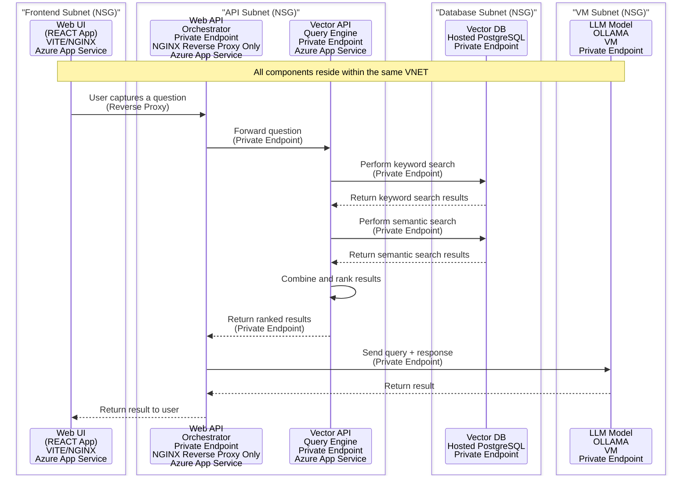
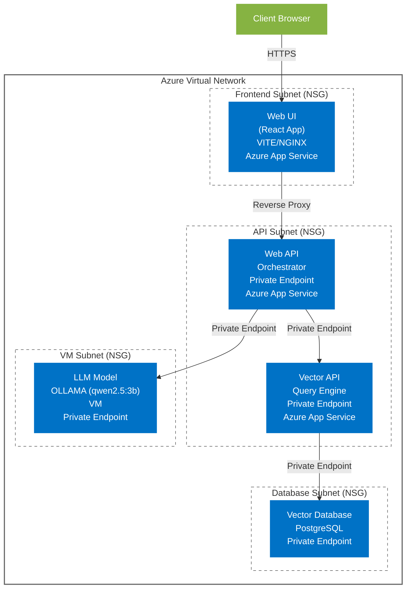

# Architecture

## Flow

## AI Models Configuration

### Vector API Models

| Purpose | Model Name | Description |
|---------|------------|-------------|
| Cross Encoder | `cross-encoder/ms-marco-MiniLM-L-2-v2` | Used for re-ranking search results |
| Embeddings | `all-mpnet-base-v2` | Used for generating vector embeddings |
| Keyword Processing | `all-mpnet-base-v2` | Used for keyword extraction and processing |

### LLM Configuration

| Service | Model | Description |
|---------|-------|-------------|
| OLLAMA | `qwen2.5:3b` | Lightweight LLM for text generation and RAG responses |

## Components Diagram

