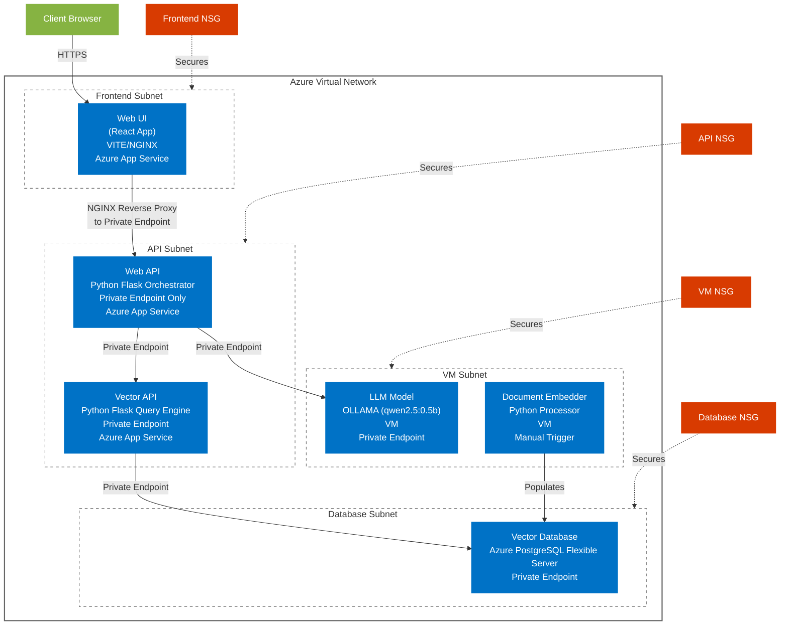
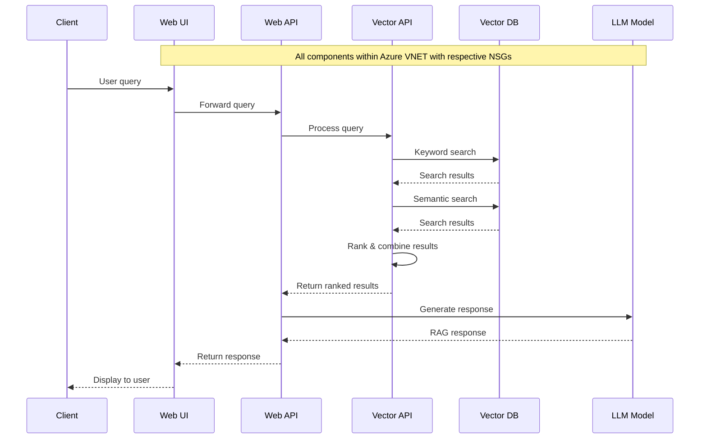

# Architecture

## Components Diagram

## Flow

## AI Models Configuration

### Vector API Models

| Purpose | Model Name | Description |
|---------|------------|-------------|
| Cross Encoder | `cross-encoder/ms-marco-MiniLM-L-2-v2` | Used for re-ranking search results |
| Embeddings | `all-mpnet-base-v2` | Used for generating vector embeddings |
| Keyword Processing | `all-mpnet-base-v2` | Used for keyword extraction and processing |

### LLM Configuration

| Service | Model | Description |
|---------|-------|-------------|
| OLLAMA | `qwen2.5:0.5b` | Lightweight LLM for text generation and RAG responses |

## Deployment Environment

The EPIC.search application is currently deployed in the BC Gov Landing Zone **Test** subscription/VWAN environment only. Future plans include deployment across the complete environment structure:

| Environment | Status | Description |
|-------------|--------|-------------|
| DEV | Planned | Development environment for building and testing new features |
| TEST | Deployed | Current deployment environment for testing and validation |
| PROD | Planned | Production environment for end-user access |
| TOOLS | Planned | Supporting tools and utilities for the application |

### BC Gov Landing Zone

The application is built on the BC Government Landing Zone architecture, which provides a standardized approach to deploying applications in the Azure cloud environment.

For more information about the BC Government Landing Zone architecture, please refer to the [BC Gov Landing Zone Documentation](https://developer.gov.bc.ca/docs/default/component/public-cloud-techdocs/azure/get-started-with-azure/bc-govs-azure-landing-zone-overview/)
