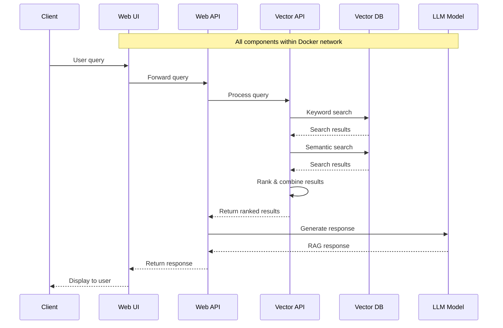

# EPIC.search

EPIC.search is an AI-powered document search and retrieval system that combines vector search capabilities with Large Language Models (LLMs) to provide intelligent document search and question answering capabilities.

## Project Overview

The system uses a modern tech stack and architecture:

- React-based web interface
- Python Flask APIs
- Vector search using PostgreSQL with pgvector
- LLM integration using OLLAMA
- Docker-based deployment

### Core Components

- **search-web**: React-based frontend application
- **search-api**: Flask-based orchestration API
- **search-vector-api**: Vector search engine API
- **search-model**: OLLAMA-based LLM service
- **embedder**: Document processing and embedding tool

## Quick Start

### Prerequisites

- [Docker](https://www.docker.com/)
- [Docker Compose](https://docs.docker.com/compose/)

### Running the Stack

1. Clone the repository

```bash
git clone <repository-url>
cd EPIC.search
```

2. Set up environment variables

```bash
# Copy sample env files for each component
cp search-api/sample.env search-api/.env
cp search-vector-api/sample.env search-vector-api/.env
cp search-web/sample.env search-web/.env
```

3. Start the services

```bash
docker compose up -d
```

This will start all the required services:

- Web UI at http://localhost:3000
- Search API at http://localhost:3200
- Vector API at http://localhost:3300
- OLLAMA Model at http://localhost:11434

## Component Architecture



## AI Models

### Vector Search Models

- Cross Encoder: `cross-encoder/ms-marco-MiniLM-L-2-v2`
- Embeddings: `all-mpnet-base-v2`
- Keyword Processing: `all-mpnet-base-v2`

### LLM Configuration

- OLLAMA with `qwen2.5:0.5b` model

## Detailed Documentation

Each component has its own detailed documentation:

- [Web UI Documentation](search-web/README.md)
- [Search API Documentation](search-api/DOCUMENTATION.md)
- [Vector API Documentation](search-vector-api/DOCUMENTATION.md)
- [Document Embedder Documentation](tools/embedder/DOCUMENTATION.md)

For infrastructure and deployment details:

- [Application Architecture](documentation/ARCHITECTURE.md)
- [Infrastructure & Deployment](documentation/INFRASTRUCTURE.md)
- [System Overview](documentation/OVERVIEW.md)

## Development

### Running Individual Components

Each component can be run independently for development:

#### Search API

```bash
cd search-api
make setup
make run
```

#### Vector API

```bash
cd search-vector-api
make setup
make run
```

#### Web UI

```bash
cd search-web
npm install
npm run dev
```

#### Document Embedder

```bash
cd tools/embedder
pip install -r requirements.txt
python main.py
```

### Environment Variables

Each component requires specific environment variables. Check the `sample.env` files in each component directory for the required variables.

## Current Status

The project is currently deployed in the BC Gov Landing Zone Test environment. Production deployment is planned for the future.

## License

See the [LICENSE](LICENSE) file for details.
