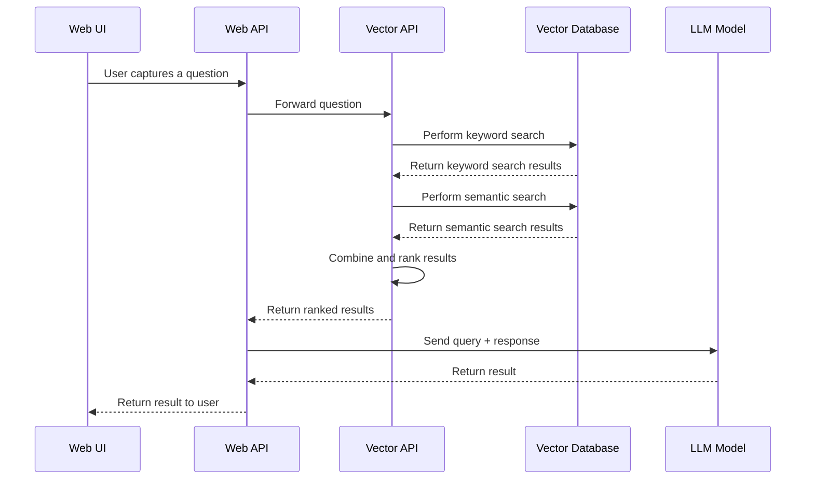

# Setup and Benchmarks

For the initial setup and round of performance tests the following setup hosted in BC Gov Azure is in place:

**The main components (Query):**

*Web Interface*: React web application serving as the user interface.
*Web API*: The entry point into the application tier, this serves as an orchestrator to handle the query provided by the user through the user interface and interact with the underlying components.
*Vector API*: Responsible for the actual query building and execution of queries against the underlying database.
*Vector Scale Database*: The PostgreSQL database where the vectorized documents are stored and queried.
*LLM Model*: The host of the OLLAMA model that is used for the query summarization.

Embedder: This component firstly queries the openly available EPIC search API's to establish the documents relevant to a project. With that retrieved information it retrieves the documents from the underlying S3 storage and embeds this document into the vector database employing a chunking strategy.

*Query Flow:*



*Query Flow and Components:*

**Web Component:**
React web application.
There is an Web Application which serves as the web portal for the user to query.
This is hosted as a public Azure Application Service.
This assigned compute is in a shared App Service plan, the compute is shared with the *Web API* component.

**Web API:**
Orchestration Web API is built with Python and Flask.
Forwards the users query to the Vector API, and then embeds the result into a context to be forwarded on to the configured LLM for summarization.
This is hosted as a private Azure Application Service.
The result of the summarization and retrieved documents are then returned to the user.

Assigned compute for the above two components (this is shared App Service plan):

| Specification               | Details                         |
|-----------------------------|---------------------------------|
| **Instance Series**         | Basic B3                        |
| **ACU/vCPU**                | 100                             |
| **vCPUs**                   | 4                               |
| **RAM (GiB)**               | 7                               |
| **Remote Storage (GiB)**    | 10                              |
| **Scale (Instance)**        | 3                               |
| **SLA Availability**        | 99.95%                          |
| **Cost (Pay-as-you-go)**    | CAD $0.09/hour                  |
| **Monthly Estimate**        | CAD $65.70 (based on 720 hours) |

This is running as a single instance (i.e. not scaled out)

**Vector API:**
Python Flask Web API.
Receives the query from the (Orchestration) Web API.
Builds and queries the database using a keyword search as well as a semantic search.
The results are then ranked by relevance.
This is hosted as a private Azure Application Service.
The result set is return the the Orchestration API.

Hosted in its own (non-shared) app service plan:

| Specification               | Details                         |
|-----------------------------|---------------------------------|
| **Instance Series**         | Basic B3                        |
| **ACU/vCPU**                | 100                             |
| **vCPUs**                   | 4                               |
| **RAM (GiB)**               | 7                               |
| **Remote Storage (GiB)**    | 10                              |
| **Scale (Instance)**        | 3                               |
| **SLA Availability**        | 99.95%                          |
| **Cost (Pay-as-you-go)**    | CAD $0.09/hour                  |
| **Monthly Estimate**        | CAD $65.70 (based on 720 hours) |

**LLM Model:**
Self hosted Azure Application Service running OLLAMA with configurable model support (default: QWEN2.5 - 0.5B)

| Specification               | Details                           |
|-----------------------------|-----------------------------------|
| **Instance Series**         | Premium v3 P2V3                   |
| **ACU/vCPU**                | 195                               |
| **vCPUs**                   | 4                                 |
| **RAM (GiB)**               | 16                                |
| **Remote Storage (GiB)**    | 250                               |
| **Scale (Instance)**        | 30                                |
| **SLA Availability**        | 99.95%                            |
| **Cost (Pay-as-you-go)**    | CAD $0.43/hour                    |
| **Monthly Estimate**        | CAD $313.973 (based on 720 hours) |

**Vector Scale Database (PostgreSQL):**
Self configured Azure VM

| Specification               | Details           |
|-----------------------------|-------------------|
| **Size**                    | Standard D4s v3   |
| **vCPUs**                   | 4                 |
| **RAM (GiB)**               | 16 RAM            |
| **Source image publisher**  | canonical         |
| **Source image offer**      | ubuntu-24_04-lts  |
| **Source image plan**       | server            |
| **Size**                    | 1024 GiB          |
| **Storage type**            | Premium SSD LRS   |
| **IOPS**                    | 5000              |
| **Throughput (MBps)**       | 200               |
| **Disk tier**               | P30               |
| **PostgreSQL**              | 17.4              |
| **Cost**                    | CA $208.05/month  |

## Test Parameters

| Specification               | Details           |
|-----------------------------|-------------------|
| LLM_MAX_TOKENS              | 250               |
| LLM_MAX_CONTEXT_LENGTH      | 4096              |
| EMBEDDING_DIMENSIONS        | 768               |
| KEYWORD_FETCH_COUNT         | 100               |
| SEMANTIC_FETCH_COUNT        | 100               |
| TOP_RECORD_COUNT            | 10                |
| LLM_MODEL                   | qwen2.5:0.5b      |
| LLM_TEMPERATURE             | 0.3               |
| SENTENCE_TRANSFORMER_MODEL  | all-mpnet-base-v2 |
| CROSS_ENCODER_MODEL         | cross-encoder/ms-marco-MiniLM-L-2-v2 |


These values we tested and tweaked in local tests running on Mac Studio with 24 cores and 128Gb memory.

## Testing

**Basic Test:**
Question : Who is the main proponent in the Coyote Hydrogen project?
Test Conditions: There are only 6 documents embedded into the Vector DB, this is a as simple as it gets performance test to validate hardware changes and setup. Once a substantial amount of data has been embedded into the Vector DB, more performance tests with be run and further adjustments made.

**Result 1:**
The main proponent of the Coyote Hydrogen project is Canada Fortescue Future Industries. The company has been involved in the project since its inception and has provided significant support to the development of the project.

``` Json
"metrics": {
            "start_time": "2025-04-17 18:33:16 UTC",
            "get_synthesizer_time": 0.0,
            "search_time_ms": 18292.97,
            "search_breakdown": {
                "keyword_search_ms": 5244.43,
                "semantic_search_ms": 7458.68,
                "combine_results_ms": 0.4,
                "deduplication_ms": 5.61,
                "reranking_ms": 5487.99,
                "formatting_ms": 0.15,
                "total_search_ms": 18197.34
            },
            "llm_time_ms": 47145.34,
            "total_time_ms": 65438.39
        }
```

**Result 2:**
The main proponent of the Coyote Hydrogen project is Canada Fortescue Future Industries.

``` Json
"metrics": {
            "start_time": "2025-04-17 18:36:00 UTC",
            "get_synthesizer_time": 0.0,
            "search_time_ms": 24708.64,
            "search_breakdown": {
                "keyword_search_ms": 9578.34,
                "semantic_search_ms": 7919.59,
                "combine_results_ms": 0.59,
                "deduplication_ms": 0.68,
                "reranking_ms": 7105.85,
                "formatting_ms": 0.21,
                "total_search_ms": 24605.34
            },
            "llm_time_ms": 1513.46,
            "total_time_ms": 26222.17
        }
```

**Result 3:**
The main proponent of the Coyote Hydrogen project is Canada Fortescue Future Industries. The company has been involved in evaluating and prioritizing hydrogen projects for locations with favorable green energy policies and affordable renewable energy, including Prince George, British Columbia.

``` Json
"metrics": {
            "start_time": "2025-04-17 18:37:08 UTC",
            "get_synthesizer_time": 0.0,
            "search_time_ms": 20506.99,
            "search_breakdown": {
                "keyword_search_ms": 10525.71,
                "semantic_search_ms": 3989.17,
                "combine_results_ms": 0.39,
                "deduplication_ms": 0.56,
                "reranking_ms": 5900.81,
                "formatting_ms": 0.19,
                "total_search_ms": 20417.32
            },
            "llm_time_ms": 3783.77,
            "total_time_ms": 24290.83
        }
```

**Result 4:**
The main proponent of the Coyote Hydrogen project is Canada Fortescue Future Industries. This company was involved in the environmental assessment and has provided comments on the project's role in decarbonization, Indigenous health impacts, and broader community benefits.

``` Json
"metrics": {
            "start_time": "2025-04-17 18:38:18 UTC",
            "get_synthesizer_time": 0.0,
            "search_time_ms": 20518.84,
            "search_breakdown": {
                "keyword_search_ms": 8480.49,
                "semantic_search_ms": 5571.25,
                "combine_results_ms": 5.28,
                "deduplication_ms": 0.69,
                "reranking_ms": 6376.72,
                "formatting_ms": 0.16,
                "total_search_ms": 20434.65
            },
            "llm_time_ms": 3621.51,
            "total_time_ms": 24140.41
        }
```

**Summary:**
There is an average of between 15 - 20 seconds to query the vector database.
The time taken by the LLM to summarize can be quite different based on the length of the response (even to the same question) and resource availability*. With further testing not documented here, on average the LLM inference takes between 3 - 5 seconds with this setup with some outliers in either direction.

**The main components (Embedder):**

The initial embedding was done with an Azure App Service.
This embedded 6 documents using the compute:

| Specification               | Details                         |
|-----------------------------|---------------------------------|
| **Instance Series**         | Basic B3                        |
| **ACU/vCPU**                | 100                             |
| **vCPUs**                   | 4                               |
| **RAM (GiB)**               | 7                               |
| **Remote Storage (GiB)**    | 10                              |
| **Scale (Instance)**        | 3                               |
| **SLA Availability**        | 99.95%                          |
| **Cost (Pay-as-you-go)**    | CAD $0.09/hour                  |
| **Monthly Estimate**        | CAD $65.70 (based on 720 hours) |

This took around an hour to embed just 6 documents and the compute was maxed out during the process.

``` json
    {
        "message": "Processing completed",
        "results": [{"project_name": "Coyote Hydrogen Project", "duration_seconds": 3103.101311}]
    }
```

This highlights the need for not only the amount of CPU, but different category/type of CPU being assigned to these operations.

As an alterate setup some of the ACI setup was tried, but have run into restrictions on resouce availability for these once off container runs - (limit to 4cpu and 8Gib)
There were a number of attemps with azure functions, logic apps, and container apps, but kept running into issues with either guardrails or non descriptive errors during setup.

*Running on a VM:*
As an alternate solution and keeping it simple, deploying a Azure VM and deallocating when not is use a higher spec at a at lower cost seems to be a much better option with using automation tasks to allocate and execute the embedder.

| Specification               | Details                          |
|-----------------------------|----------------------------------|
| **Instance Series**         | F8s_v2 (Compute Optimized)       |
| **ACU/vCPU**                | 100                              |
| **vCPUs**                   | 8                                |
| **RAM (GiB)**               | 16                               |
| **Data Disks**              | 16                               |
| **Max IOPS**                | 12800                            |
| **Local Storage**           | 64 (SCSI)                        |
| **Premium Disk**            | Supported                        |
| **Monthly Estimate**        | CAD $346.75 (based on 720 hours) |

``` json
    {
        "message": "Processing completed",
        "results": [{"project_name": "Coyote Hydrogen Project", "duration_seconds": 111.109867}]
    }
```

## Updates (Round 2)

For round 2 of testing, the following changes were introduced from the above:

- Move the Model host from an Azure Application Service to a Azure VM instance:

| Specification               | Details           |
|-----------------------------|-------------------|
| **Size**                    | F4s_v2            |  
| **Type**                    | Compute optimized |
| **vCPUs**                   | 4                 |
| **RAM (GiB)**               | 8                 |
| **Data Disks**              | 8                 |
| **Max IOPS**                | 6400              |
| **Local Storage**           | 32 (SCSI)         |
| **Premium Disk**            | Supported         |
| **Monthly Estimate**        | CA$173.01         |

**Basic Test:**
Question : Who is the main proponent in the Coyote Hydrogen project?
Test Conditions: There are only 6 documents embedded into the Vector DB.

**Result 1:**
"John Antill, the primary contact for the Canada Fortescue Future Industries project in Prince George, British Columbia. He is responsible for participating in the environmental assessment of the Coyote Hydrogen Project and has been involved in providing feedback on the project's potential impacts on Indigenous communities and traditional territories.",

```json
 "metrics": {
            "start_time": "2025-04-28 16:45:11 UTC",
            "get_synthesizer_time": 0.0,
            "search_time_ms": 27597.43,
            "search_breakdown": {
                "keyword_search_ms": 11879.43,
                "semantic_search_ms": 8025.93,
                "combine_results_ms": 0.73,
                "deduplication_ms": 7.63,
                "reranking_ms": 7579.82,
                "formatting_ms": 7.11,
                "total_search_ms": 27500.77
            },
            "llm_time_ms": 43956.26,
            "total_time_ms": 71553.76
        }
```

**Result 2:**
Based on the information provided, John Antill is the main proponent of the Coyote Hydrogen Project. He serves as the Project Assessment Director for Fortescue Canada and has been involved in the environmental assessment process for the project. The text mentions that the Canadian government has approved the project, indicating that it represents a significant investment by the federal government.

```json
  "metrics": {
            "start_time": "2025-04-28 16:46:52 UTC",
            "get_synthesizer_time": 0.0,
            "search_time_ms": 27625.92,
            "search_breakdown": {
                "keyword_search_ms": 7872.8,
                "semantic_search_ms": 10085.18,
                "combine_results_ms": 0.56,
                "deduplication_ms": 0.74,
                "reranking_ms": 9584.65,
                "formatting_ms": 0.21,
                "total_search_ms": 27544.23
            },
            "llm_time_ms": 4526.44,
            "total_time_ms": 32152.43
        }      
```

**Result 3:**
According to the provided information, John Antill is the main proponent of the Coyote Hydrogen Project. He served as the Project Assessment Director for Fortescue Canada and was involved in the environmental assessment process for the project. The text mentions that John Antill has a background in environmental assessments and works with BC government agencies such as the BC Environmental Assessment Office (EAO) to assess projects like the Coyote Hydrogen Project.

```json
 "metrics": {
            "start_time": "2025-04-28 16:48:21 UTC",
            "get_synthesizer_time": 0.0,
            "search_time_ms": 24662.02,
            "search_breakdown": {
                "keyword_search_ms": 9172.06,
                "semantic_search_ms": 8724.08,
                "combine_results_ms": 0.46,
                "deduplication_ms": 7.5,
                "reranking_ms": 6644.07,
                "formatting_ms": 0.32,
                "total_search_ms": 24548.6
            },
            "llm_time_ms": 5497.03,
            "total_time_ms": 30159.11
        }
```

**Summary:**
In general response times are as good on average - and this compute runs at half the cost. We do lose the auto scalability from the Azure App service available but while still running as a POC this makes more sense. Ultimately I believe this should be called a payed for service (i.e. OpenAI) and paying as needed.

**Automation Accounts:**

Initially for POC the model and database virtual machines are deallocated from 7PM through to 7AM PST to save costs.

### Considerations

With both of the VM's setup, they are manually configured and require some scalining configuration for long term production.
As an alterantivate for the data, we could move away from the TimeScale DB which relies on the vectorscale extension, and move to a managed service that only relies on the pgvector extension - this would require code changes to the vector-api component and embedder.

**Upscaling Test with Production Grade Compute:**

With this set of test, the plan was to temporarily scale up the services to highly over speced compute for the current set of data and requirements to see the difference this makes on the overall processing of requests.

*Model Host VM*: F4s_v2 -> F16s_v2

| Specification               | Details           |
|-----------------------------|-------------------|
| **Size**                    | F16s_v2           |  
| **Type**                    | Compute optimized |
| **vCPUs**                   | 16                |
| **RAM (GiB)**               | 32                |
| **Data Disks**              | 32                |
| **Max IOPS**                | 25600             |
| **Local Storage**           | 128 (SCSI)        |
| **Premium Disk**            | Supported         |
| **Monthly Estimate**        | CA$692.04         |

**Basic Test:**
Question : Who is the main proponent in the Coyote Hydrogen project?
Test Conditions: There are only 6 documents embedded into the Vector DB.

**Result 1:**
The main proponent in the Coyote Hydrogen project is Canada Fortescue Future Industries. The company has been involved with the project since its inception and has provided significant support to the development of the project.

```json
  "metrics": {
            "start_time": "2025-04-28 17:04:49 UTC",
            "get_synthesizer_time": 0.0,
            "search_time_ms": 25506.14,
            "search_breakdown": {
                "keyword_search_ms": 9017.43,
                "semantic_search_ms": 9195.68,
                "combine_results_ms": 0.52,
                "deduplication_ms": 0.7,
                "reranking_ms": 7174.83,
                "formatting_ms": 0.18,
                "total_search_ms": 25389.41
            },
            "llm_time_ms": 1137.89,
            "total_time_ms": 26644.12
        }
```

**Result 2:**
The main proponent in the Coyote Hydrogen project is Canada Fortescue Future Industries. The company has been involved in the environmental assessment of the project, and it has also participated in the EAO's review process.

```json
 "metrics": {
            "start_time": "2025-04-28 17:06:42 UTC",
            "get_synthesizer_time": 0.0,
            "search_time_ms": 23557.64,
            "search_breakdown": {
                "keyword_search_ms": 7996.97,
                "semantic_search_ms": 8358.66,
                "combine_results_ms": 0.5,
                "deduplication_ms": 0.79,
                "reranking_ms": 7070.32,
                "formatting_ms": 0.18,
                "total_search_ms": 23427.5
            },
            "llm_time_ms": 2348.07,
            "total_time_ms": 25905.78
        }
```

**Result 3:**
Based on the information provided in the context, John Antill is the main proponent for the Coyote Hydrogen Project. He serves as the project assessment director and has been involved in evaluating various projects related to green hydrogen production. The text mentions that he was part of the environmental assessment office (EAO) for the proposed Coyote Hydrogen Project in Prince George, British Columbia.

```json
 "metrics": {
            "start_time": "2025-04-28 17:07:23 UTC",
            "get_synthesizer_time": 0.0,
            "search_time_ms": 25824.59,
            "search_breakdown": {
                "keyword_search_ms": 10091.07,
                "semantic_search_ms": 8605.7,
                "combine_results_ms": 0.49,
                "deduplication_ms": 7.59,
                "reranking_ms": 7010.96,
                "formatting_ms": 0.26,
                "total_search_ms": 25716.17
            },
            "llm_time_ms": 1142.89,
            "total_time_ms": 26967.55
        }
```

**Summary:**
With this scaled up - the llm time comes down from an average of 5 seconds to under 2 seconds after some repeat testing.

*Vector API* : Basic B3 -> Premium v3 P2mv3

| Specification               | Details                           |
|-----------------------------|-----------------------------------|
| **Instance Series**         | Premium v3 P2V3                   |
| **ACU/vCPU**                | 195                               |
| **vCPUs**                   | 4                                 |
| **RAM (GiB)**               | 16                                |
| **Remote Storage (GiB)**    | 250                               |
| **Scale (Instance)**        | 30                                |
| **SLA Availability**        | 99.95%                            |
| **Cost (Pay-as-you-go)**    | CAD $0.43/hour                    |
| **Monthly Estimate**        | CAD $313.973 (based on 720 hours) |

**Basic Test:**
Question : Who is the main proponent in the Coyote Hydrogen project?
Test Conditions: There are only 6 documents embedded into the Vector DB.

**Result 1:**
The main proponent in the Coyote Hydrogen project is Canada Fortescue Future Industries. This company was involved in the environmental assessment of the proposed project and has provided feedback to the BC government, City of Prince George, and the Lheidli T'enneh Nation. The Coyote Hydrogen Project aims to produce hydrogen that will be distributed within B.C. for domestic use, as well as ammonia that is planned to be sold both domestically and to export markets. The project would include production, storage and loadout components for hydrogen and ammonia, water diversion works and wastewater treatment, process cooling units, power supply systems, and rail and truck loading infrastructure. The Coyote Hydrogen Project is located in the traditional territory of the Lheidli T'enneh Nation, who are part of the environmental assessment office (EAO) will ask to participate in the assessment.

```json
 "metrics": {
            "start_time": "2025-04-28 17:13:53 UTC",
            "get_synthesizer_time": 0.0,
            "search_time_ms": 4575.39,
            "search_breakdown": {
                "keyword_search_ms": 1021.3,
                "semantic_search_ms": 969.43,
                "combine_results_ms": 0.35,
                "deduplication_ms": 0.52,
                "reranking_ms": 2497.62,
                "formatting_ms": 0.16,
                "total_search_ms": 4489.45
            },
            "llm_time_ms": 4453.16,
            "total_time_ms": 9028.62
        }
```

**Result 2:**
The main proponent in the Coyote Hydrogen project is Canada Fortescue Future Industries. This company has been involved in various projects, including the construction of the Willow Cale Industrial Park and the proposed Coyote Hydrogen Project. The company aims to develop a hydrogen production facility within the traditional territory of the Lheidli T'enneh Nation, specifically located at the Willow Cale Industrial Park in Prince George, British Columbia.

```json
        "metrics": {
            "start_time": "2025-04-28 17:16:27 UTC",
            "get_synthesizer_time": 0.0,
            "search_time_ms": 5961.58,
            "search_breakdown": {
                "keyword_search_ms": 1652.89,
                "semantic_search_ms": 1052.63,
                "combine_results_ms": 0.59,
                "deduplication_ms": 0.59,
                "reranking_ms": 3139.29,
                "formatting_ms": 0.14,
                "total_search_ms": 5846.19
            },
            "llm_time_ms": 2231.67,
            "total_time_ms": 8193.33
        }
```

**Result 3:**
The main proponent in the Coyote Hydrogen project is Canada Fortescue Future Industries. The company has completed an environmental assessment of the proposed Project and is currently awaiting approval from the BC Government, City of Prince George, and the Lheidli T'enneh Nation.

```json
 "metrics": {
            "start_time": "2025-04-28 17:17:04 UTC",
            "get_synthesizer_time": 0.0,
            "search_time_ms": 6847.05,
            "search_breakdown": {
                "keyword_search_ms": 1766.92,
                "semantic_search_ms": 962.07,
                "combine_results_ms": 0.59,
                "deduplication_ms": 0.6,
                "reranking_ms": 4008.51,
                "formatting_ms": 0.14,
                "total_search_ms": 6738.91
            },
            "llm_time_ms": 1493.1,
            "total_time_ms": 8340.22
        }
```

**Summary:**
With the upscale the search time reduces quite significantly.
We have cut the search time from over 20 seconds average to around 5 seconds on average.
