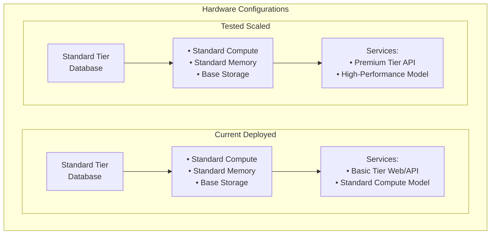
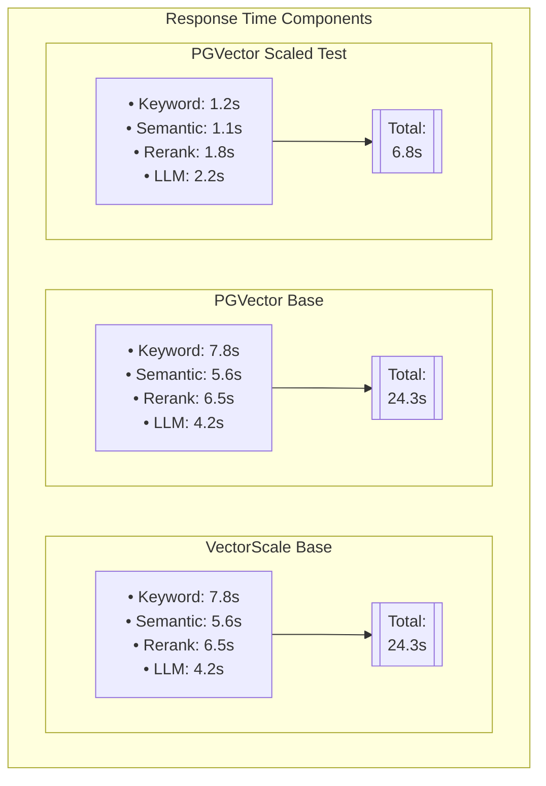
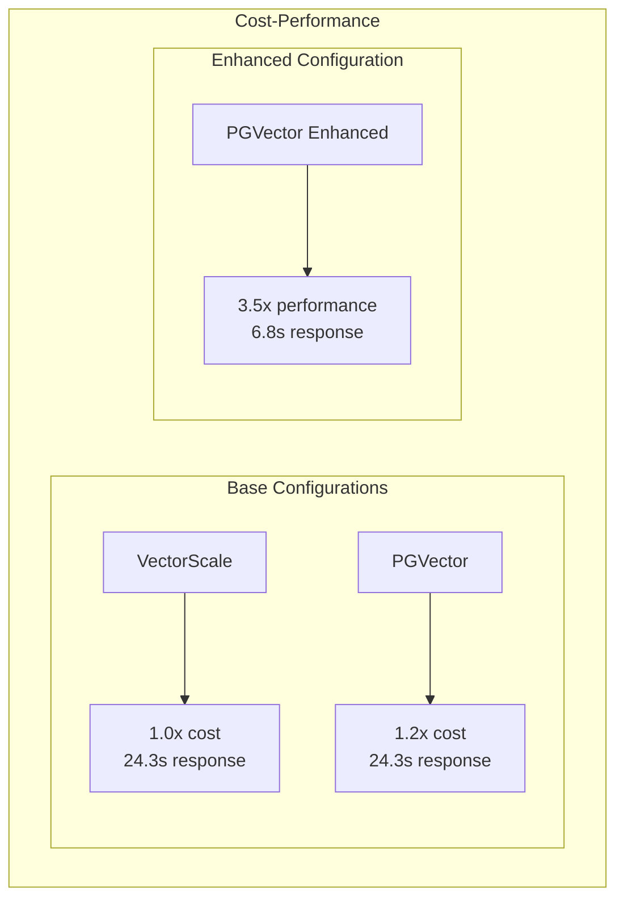
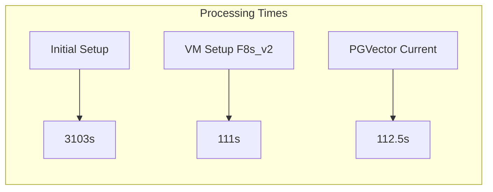
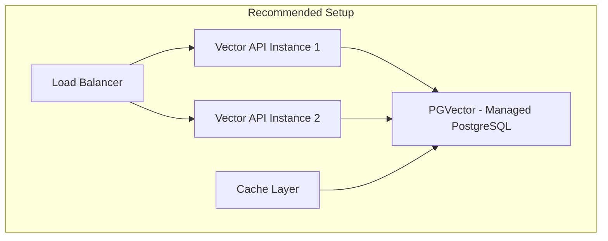
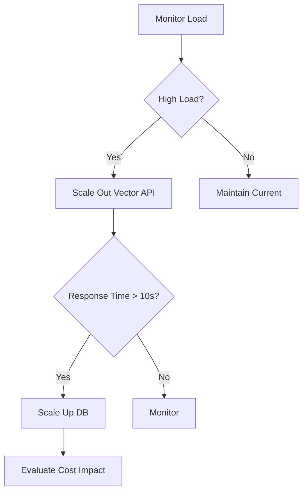

# EPIC.search Performance Analysis

This document analyzes the performance metrics and cost-effectiveness across different infrastructure configurations of the EPIC.search RAG application. It focuses on two key transitions:

1. Migration from VectorScale to PGVector
2. Performance testing with scaled hardware configurations to evaluate potential benefits

Note: While higher-specification hardware was tested to evaluate performance benefits, the current deployed environment runs on the base configuration. This analysis helps inform future scaling decisions.

## Architecture Evolution

```mermaid
graph TD
    subgraph Initial[Initial Setup - VectorScale]
        A1[Web UI - Basic B3] --> B1[Web API - Basic B3]
        B1 --> C1[Vector API - Basic B3]
        C1 --> D1[VectorScale DB - D4s v3 VM]
        B1 --> E1[LLM Model - P2V3]
    end

    subgraph Current[Current Deployed Setup - PGVector]
        A2[Web UI - Basic B3] --> B2[Web API - Basic B3]
        B2 --> C2[Vector API - Basic B3]
        C2 --> D2[PGVector - Managed PostgreSQL D4s_v3]
        B2 --> E2[LLM Model - F4s_v2]
    end

    subgraph Tested[Tested Scaled Configuration]
        A3[Web UI - Basic B3] --> B3[Web API - Basic B3]
        B3 --> C3[Vector API - Premium P2V3]
        C3 --> D3[PGVector - Managed PostgreSQL D4s_v3]
        B3 --> E3[LLM Model - F16s_V2]
    end
```

## Hardware Configurations Comparison

### Service Tier Comparison

| Component | Current Deployed | Tested Scaled Setup |
|-----------|-----------------|-------------------|
| Database | Standard Tier | Standard Tier |
| Vector API | Basic Tier | Premium Tier |
| Model Host | Standard Compute | High-Performance Compute |
| **Scale Level** | **Base Configuration** | **Enhanced Configuration** |

## Performance Metrics

### Response Time Breakdown

### Cost vs Performance Analysis

> **Note:** The costs shown here are relative comparisons of primary component costs only. These are rough estimates that focus on the main infrastructure components. Additional costs from supporting resources like public IPs, storage, networking, monitoring, and other Azure services are not included in these comparisons.

## Key Performance Indicators

| Configuration | Avg Response Time | Relative Cost | Performance Gain | Cost-Performance Ratio |
|--------------|------------------|---------------|------------------|----------------------|
| VectorScale Base | 24.3s | 1.0x | 1.0x | 1.0 |
| PGVector Base | 24.3s | 1.2x | 1.0x | 0.84 |
| PGVector Scaled | 6.8s | 3.2x | 3.6x | 1.12 |

## Document Processing Performance

## Analysis and Recommendations

### Current Performance Bottlenecks

1. **Single Instance Deployment**
   - All configurations are running single instances
   - No horizontal scaling capabilities utilized
   - Limited failover and high availability

2. **Resource Utilization**
   - Base configurations show high resource utilization
   - Scaled configuration demonstrates better resource distribution

### Recommendations

1. **Infrastructure Optimization**
   - Consider implementing auto-scaling for Vector API and LLM components
   - Evaluate PostgreSQL connection pooling
   - Implement caching layer for frequently accessed vectors

2. **Cost Optimization**

3. **Performance Tuning**
   - Implement query result caching
   - Optimize vector indexing strategies
   - Configure connection pooling
   - Fine-tune PostgreSQL parameters for vector operations

### Scaling Strategy

## Conclusions

1. **Current Deployed Setup**
   - Running on base PGVector configuration
   - Single instances of all components
   - Average response time: ~25s (with cold starts up to 40s)
   - Base tier services

2. **Tested Scaling Benefits**
   - ~3.5x performance improvement
   - Improved reliability and consistency
   - Positive cost-performance ratio
   - Enhanced concurrent user support
   - Shows significant potential for high-traffic scenarios

3. **Scaling Recommendations**
   - Consider gradual scaling based on traffic
   - Start with Vector API scaling (most impact)
   - Monitor query patterns to optimize scaling decisions
   - Implement horizontal scaling before vertical scaling where possible

4. **Future Optimization Opportunities**
   - Implement caching layer to reduce database load
   - Add connection pooling
   - Consider hybrid scaling approach
   - Regular performance monitoring and cost analysis
