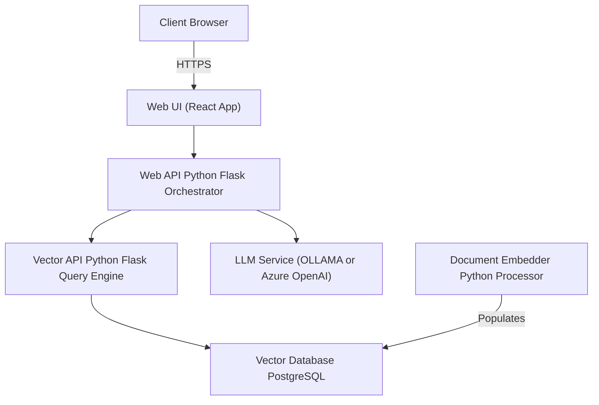

# Application Architecture

## Overview

EPIC.search is a document search and retrieval system using modern AI techniques including vector search and Large Language Models (LLMs).

## Components Diagram

## Component Descriptions

- **Web UI**: React-based front-end application providing user interface
- **Web API**: Flask-based orchestration layer managing request flow
- **Vector API**: Specialized search engine handling vector and keyword searches
- **Vector Database**: PostgreSQL database storing document vectors and metadata
- **LLM Service**: AI model service (OLLAMA or Azure OpenAI) providing natural language understanding
- **Document Embedder**: Processing service converting documents to vectors

## Application Flow

## AI Models Configuration

### Vector API Models

| Purpose | Model Name | Description |
|---------|------------|-------------|
| Cross Encoder | `cross-encoder/ms-marco-MiniLM-L-2-v2` | Used for re-ranking search results |
| Embeddings | `all-mpnet-base-v2` | Used for generating vector embeddings |
| Keyword Processing | `all-mpnet-base-v2` | Used for keyword extraction and processing |

### LLM Service Configuration

The system requires an LLM service for response generation. The deployment can use either OLLAMA or Azure OpenAI based on configuration settings:

| Service | Example Model | Configuration | Deployment Type |
|---------|--------------|---------------|-----------------|
| OLLAMA | `qwen2.5:0.5b` | Configurable via `MODEL_NAME` and `MODEL_VERSION` environment variables. Supports any Ollama-compatible model. | Self-hosted on VM |
| Azure OpenAI | `gpt-3.5-turbo` or `gpt-4` | Configurable via Azure OpenAI service endpoints and API keys. | Azure managed service |

**Configuration Setting**: The `LLM_PROVIDER` environment variable determines which service to use:

- `LLM_PROVIDER=ollama` - Uses OLLAMA service
- `LLM_PROVIDER=azure_openai` - Uses Azure OpenAI service

**Note**: Exactly one LLM provider must be configured and deployed for the system to function.
