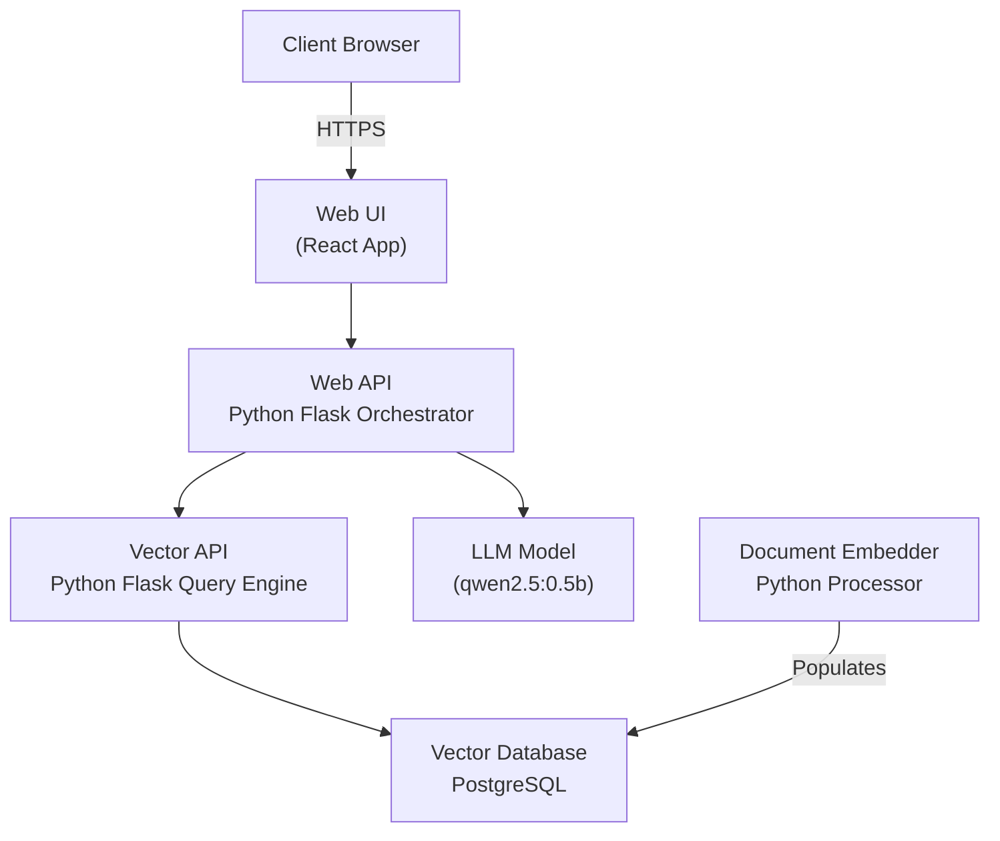
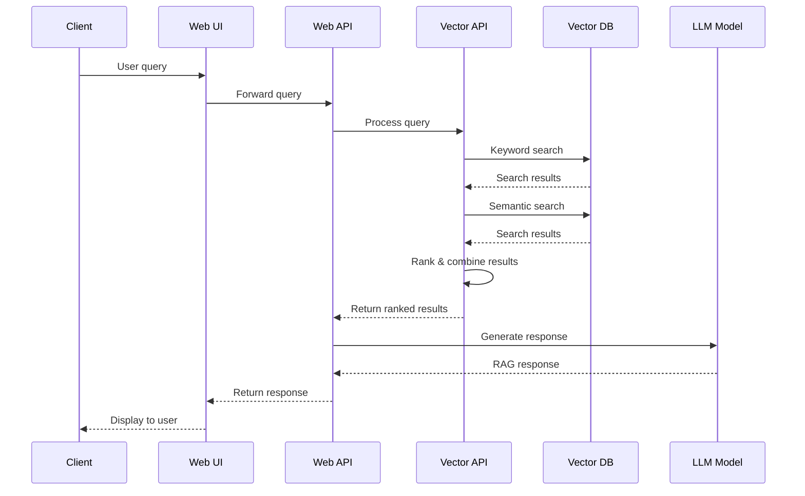

# Application Architecture

## Overview

EPIC.search is a document search and retrieval system using modern AI techniques including vector search and Large Language Models (LLMs).

## Components Diagram

## Component Descriptions

- **Web UI**: React-based front-end application providing user interface
- **Web API**: Flask-based orchestration layer managing request flow
- **Vector API**: Specialized search engine handling vector and keyword searches
- **Vector Database**: PostgreSQL database storing document vectors and metadata
- **LLM Model**: AI model providing natural language understanding
- **Document Embedder**: Processing service converting documents to vectors

## Application Flow

## AI Models Configuration

### Vector API Models

| Purpose | Model Name | Description |
|---------|------------|-------------|
| Cross Encoder | `cross-encoder/ms-marco-MiniLM-L-2-v2` | Used for re-ranking search results |
| Embeddings | `all-mpnet-base-v2` | Used for generating vector embeddings |
| Keyword Processing | `all-mpnet-base-v2` | Used for keyword extraction and processing |

### LLM Configuration

| Service | Model | Description |
|---------|-------|-------------|
| OLLAMA | `qwen2.5:0.5b` | Lightweight LLM for text generation and RAG responses |
