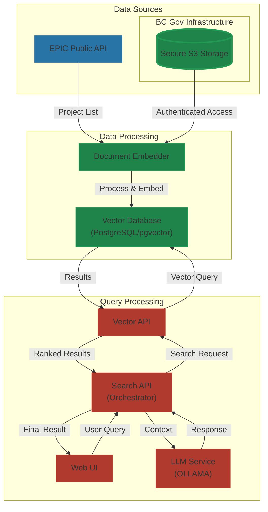
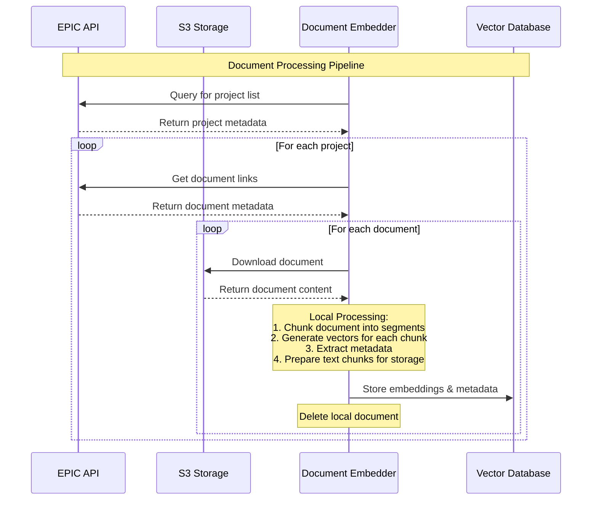
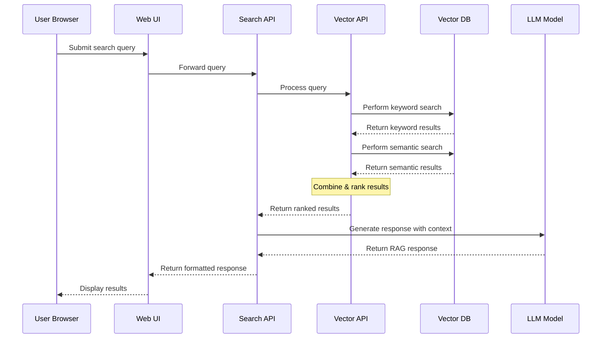

# EPIC.search Data Flow Documentation

## Data Source and Public Access

> **Note**: All data processed by EPIC.search originates from publicly available sources, though storage and access methods are secured:
> - BC EPIC (Environmental Assessment Office) public API
> - BC Government S3 storage containing copies of publicly available EPIC documents
>   - S3 storage is secured and requires authenticated access
>   - While documents are publicly available through BC websites, storage access is restricted
> - All storage systems and APIs require proper authentication
> - No private or restricted data is used in this system

## System Data Flow Overview

## Document Processing Flow

## User Query Flow

## Data Flow Stages

### 1. Data Ingestion (Document Embedder)

| Stage | Process | Details |
|-------|---------|----------|
| Initial Data Discovery | EPIC API Query | Embedder queries BC EPIC public API to retrieve project listings and associated document metadata |
| Document Retrieval | S3 Download | Documents are temporarily downloaded from S3 storage using secure credentials (documents themselves are publicly available) |
| Document Processing | Local Processing | Documents are chunked into segments, vectorized, and embedded locally |
| Data Storage | Vector Database | Processed embeddings, text chunks, and metadata stored in PostgreSQL with pgvector |
| Cleanup | Local Cleanup | Temporary document copies are deleted after processing |

### 2. Data Query Flow (User Interaction)

| Stage | Component | Process |
|-------|-----------|----------|
| User Query | search-web (React) | User submits search query through web interface |
| Query Orchestration | search-api (Flask) | Orchestrates the search process and RAG implementation |
| Vector Search | search-vector-api (Flask) | Performs vector similarity search and keyword matching |
| Database Query | PostgreSQL/pgvector | Retrieves relevant document chunks based on search criteria |
| Response Generation | OLLAMA (LLM) | Generates natural language responses using retrieved contexts |
| Result Delivery | Web UI | Formatted results displayed to user |

## Component Data Interactions

| Source Component | Target Component | Data Type | Flow Description |
|-----------------|------------------|------------|------------------|
| EPIC Public API | Document Embedder | Project & Document Metadata | List of projects and associated documents |
| S3 Storage | Document Embedder | Raw Documents | Access to document copies via authenticated BC Government S3 connection |
| Document Embedder | Vector Database | Embeddings, Text & Metadata | Processed document vectors, corresponding text chunks, and metadata |
| Web UI | Search API | User Queries | Search requests and parameters |
| Search API | Vector API | Search Parameters | Query processing instructions |
| Vector API | Vector Database | Query & Results | Database queries and document retrieval |
| Vector API | Search API | Search Results | Ranked and filtered results |
| Search API | LLM | Context & Query | Document context for response generation |
| Search API | Web UI | Final Response | Formatted results for user display |

## Data Retention and Privacy

- All processed data originates from public sources
- Documents are stored securely in BC Government infrastructure
- Access to storage systems requires proper authentication
- Document source links reference back to public EPIC system
- Vector database contains only:
  - Document embeddings (vector representations)
  - Associated text chunks (the actual document segments)
  - Public metadata
  - Source reference information

## Performance Considerations

| Stage | Consideration | Mitigation |
|-------|--------------|------------|
| Document Processing | Large file downloads | Temporary storage with immediate cleanup |
| Vector Search | Query performance | Optimized index and batch parameters |
| Response Generation | LLM processing time | Lightweight model selection (qwen2.5:0.5b) |
| Result Delivery | Response size | Pagination and result limiting |

> **Note**: The document embedding process is currently manually triggered. This allows for controlled updates and system maintenance windows. Future automation of this process is planned.
