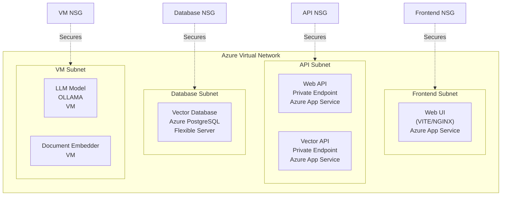
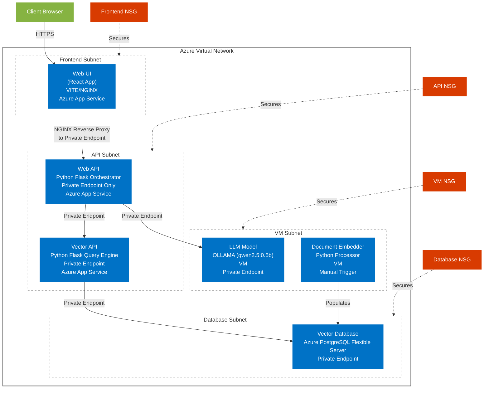

# Infrastructure & Deployment

## Azure Implementation

### Network Architecture

## Network Security Groups (NSGs)

| NSG | Purpose | Key Rules |
|-----|---------|-----------|
| Frontend NSG | Secures web UI components | - Allow HTTPS inbound - Allow health probe |
| API NSG | Protects API services | - Allow internal subnet traffic - Block external access |
| Database NSG | Secures database access | - Allow API subnet access - Block external access |
| VM NSG | Controls VM access | - Allow maintenance access - Allow internal traffic |

## BC Gov Landing Zone Implementation

### Environment Structure

| Environment | Status | Description |
|-------------|--------|-------------|
| DEV | Planned | Development environment for building and testing new features |
| TEST | Deployed | Current deployment environment for testing and validation |
| PROD | Planned | Production environment for end-user access |
| TOOLS | Planned | Supporting tools and utilities for the application |

### Landing Zone Architecture

The application is built on the BC Government Landing Zone architecture, which provides a standardized approach to deploying applications in the Azure cloud environment.

For more details, see the [BC Gov Landing Zone Documentation](https://developer.gov.bc.ca/docs/default/component/public-cloud-techdocs/azure/get-started-with-azure/bc-govs-azure-landing-zone-overview/)

## Security & Compliance

- All internal services use Private Endpoints
- Network isolation through subnet segregation
- NSG rules following least-privilege access
- Compliance with BC Government security standards

## Azure Implementation Architecture

### Detailed Component Diagram

### Component Deployment Details

[Continue with existing infrastructure documentation...]