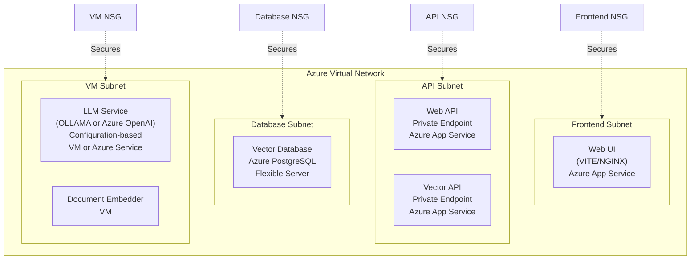
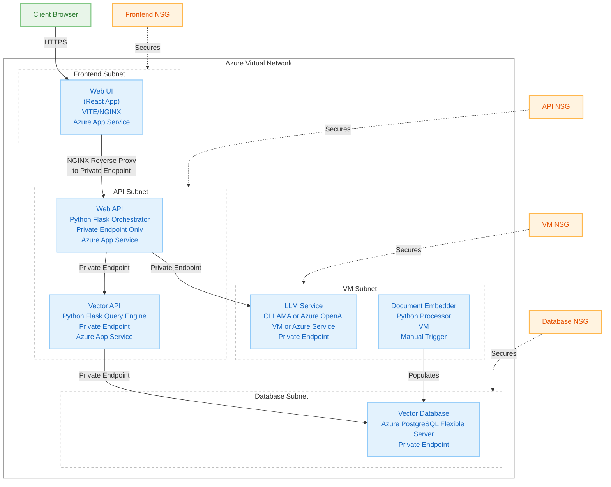

# Infrastructure & Deployment

## Azure Implementation

### Network Architecture

## Network Security Groups (NSGs)

| NSG | Purpose | Key Rules |
|-----|---------|-----------|
| Frontend NSG | Secures web UI components | - Allow HTTPS inbound - Allow health probe |
| API NSG | Protects API services | - Allow internal subnet traffic - Block external access |
| Database NSG | Secures database access | - Allow API subnet access - Block external access |
| VM NSG | Controls VM access | - Allow maintenance access - Allow internal traffic |

## BC Gov Landing Zone Implementation

### Environment Structure

| Environment | Status | Description |
|-------------|--------|-------------|
| DEV | Planned | Development environment for building and testing new features |
| TEST | Deployed | Current deployment environment for testing and validation |
| PROD | Planned | Production environment for end-user access |
| TOOLS | Planned | Supporting tools and utilities for the application |

### Landing Zone Architecture

The application is built on the BC Government Landing Zone architecture, which provides a standardized approach to deploying applications in the Azure cloud environment.

For more details, see the [BC Gov Landing Zone Documentation](https://developer.gov.bc.ca/docs/default/component/public-cloud-techdocs/azure/get-started-with-azure/bc-govs-azure-landing-zone-overview/)

## Security & Compliance

- All internal services use Private Endpoints
- Network isolation through subnet segregation
- NSG rules following least-privilege access
- Compliance with BC Government security standards

## LLM Service Deployment Options

The system requires an LLM service and supports two deployment configurations:

### OLLAMA Deployment

| Component | Resource Type | Configuration |
|-----------|---------------|---------------|
| OLLAMA Service | Azure VM | Self-hosted model serving with configurable models |
| Network | VM Subnet + Private Endpoint | Secured access within VNet |
| Model Storage | VM Local Storage | Downloaded models cached locally |
| Configuration | Environment Variables | `MODEL_NAME`, `MODEL_VERSION` |

### Azure OpenAI Deployment

| Component | Resource Type | Configuration |
|-----------|---------------|---------------|
| Azure OpenAI | Azure OpenAI Service | Managed service with GPT models |
| Network | Private Endpoint | Secured access within VNet |
| Model Access | Azure Managed | GPT-3.5-turbo, GPT-4, or other available models |
| Configuration | Environment Variables | `AZURE_OPENAI_ENDPOINT`, `AZURE_OPENAI_KEY` |

**Deployment Selection**: Set `LLM_PROVIDER=ollama` or `LLM_PROVIDER=azure_openai` to choose deployment type.

**Note**: Both options provide the same API interface to the Web API component, ensuring consistent application behavior regardless of the chosen LLM provider.

## Azure Implementation Architecture

### Detailed Component Diagram

