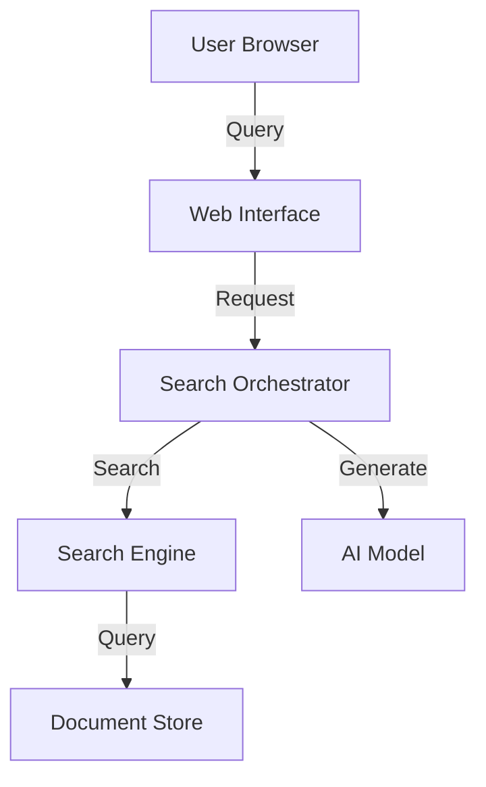

# EPIC.search Overview

EPIC.search is a document search and retrieval system that leverages AI technologies to provide intelligent document search capabilities.

## Key Features

- Semantic search using vector embeddings
- Keyword-based search capabilities
- AI-powered response generation
- Document processing and indexing
- Secure deployment within BC Government infrastructure

## Core Components

## Documentation Structure

Detailed documentation is split into two main areas:

### [Application Architecture](ARCHITECTURE.md)

- Component interactions and data flow
- AI models and configurations
- Search and retrieval processes
- Document processing pipeline

### [Infrastructure & Deployment](INFRASTRUCTURE.md)

- Azure implementation details
- Network architecture and security
- BC Gov Landing Zone integration
- Environment configurations

## Current Status

EPIC.search is deployed in the BC Gov Landing Zone **Test** environment. For detailed deployment information, see the [Infrastructure Documentation](INFRASTRUCTURE.md).

## Getting Started

- For developers: See [Application Architecture](ARCHITECTURE.md)
- For deployment: See [Infrastructure & Deployment](INFRASTRUCTURE.md)
- For API documentation: See [API Documentation](API.md)

## Contact

For questions or issues:

- Technical Lead: [Contact Information]
- Project Manager: [Contact Information]
