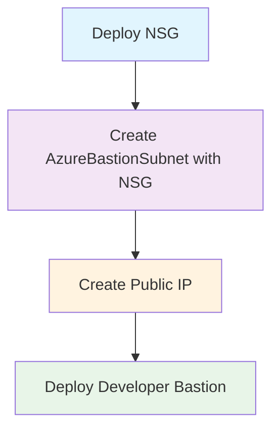

# Policy-Compliant Azure Bastion Architecture

## Summary

✅ **Policy Requirement Met**: Subnets must have NSGs before creation
✅ **Free Tier**: Developer SKU for cost-effective development
✅ **Deployment Order**: NSG → Subnet → Bastion

## Deployment Flow



## Resource Dependencies

1. **NSG Module** (`nsg.bicep`)
   - Creates Bastion-specific security rules
   - Required by policy before subnet creation

2. **Subnet Module** (`subnet.bicep`)
   - Creates AzureBastionSubnet
   - Applies NSG during creation (policy compliant)
   - Supports cross-resource group deployment

3. **Public IP Resource**
   - Standard SKU required for Bastion
   - Auto-generated DNS label

4. **Bastion Host**
   - Developer SKU (free tier)
   - No scale units (Developer SKU characteristic)
   - Basic connectivity features only

## Key Benefits

- **Cost Effective**: Developer SKU has no hourly charges
- **Policy Compliant**: NSG attached during subnet creation
- **Development Ready**: Perfect for dev/test environments
- **Scalable**: Easy upgrade path to Standard/Premium for production

## Next Steps

Deploy using:

```bash
az deployment group create \
  --resource-group rg-myproject-bastion \
  --template-file main.bicep \
  --parameters main.bicepparam
```

The templates ensure automatic policy compliance and proper resource dependencies.