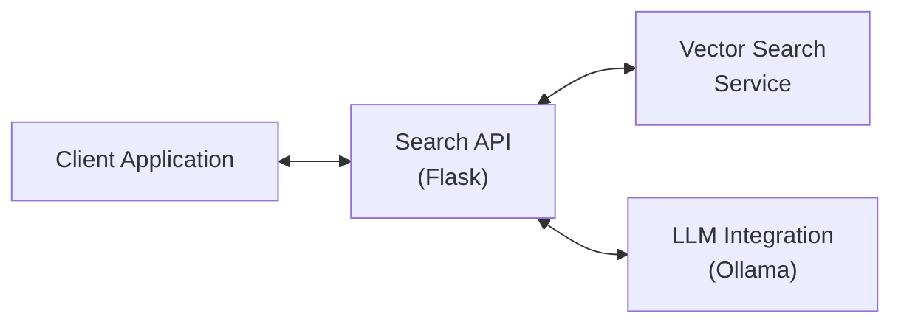

# SEARCH-API Documentation

## Overview

The Search-API is a Flask-based REST API service that implements a Retrieval-Augmented Generation (RAG) pattern. It provides a bridge between user queries, an external vector search service, and an LLM (Language Learning Model) to generate contextually relevant responses.

## Architecture

The service follows a modular architecture with the following key components:

1. **REST API Layer**: Handles incoming HTTP requests and responses
2. **Search Service**: Coordinates the search flow between vector search and LLM synthesis
3. **Synthesizer**: Manages LLM integration, prompt creation, and response formatting
4. **External Vector Search**: Retrieves relevant document information based on user queries

## Component Diagram



## Workflow

1. Client sends a search query through REST API
2. Search Service forwards the query to the external Vector Search service
3. Vector Search service returns relevant document information
4. Search Service formats the documents and creates a prompt for the LLM
5. LLM (Ollama) processes the prompt to generate a summary/response
6. Search Service formats the response and returns it to the client with document information and performance metrics

## API Endpoints

### POST /api/search

Processes a search query and returns relevant documents with an LLM-generated summary.

**Request:**

```json
{
  "question": "What is the environmental impact of the project?"
}
```

**Response:**

```json
{
  "result": {
    "response": "LLM-generated summary based on the documents",
    "documents": [
      {
        "document_id": "123",
        "document_name": "Environmental Assessment Report",
        "document_type": "Report",
        "content": "Document content excerpt...",
        "page_number": "45",
        "project_id": "P-123",
        "project_name": "Example Project"
      }
    ],
    "metrics": {
      "start_time": "2025-05-15 14:30:45 UTC",
      "get_synthesizer_time": 12.34,
      "search_time_ms": 234.56,
      "search_breakdown": { /* detailed search metrics */ },
      "llm_time_ms": 345.67,
      "total_time_ms": 592.57
    }
  }
}
```

## Configuration

### Environment Variables

| Variable | Description | Default |
|----------|-------------|---------|
| VECTOR_SEARCH_API_URL | URL for the external vector search service |  |
| LLM_HOST | Host address for the LLM service |  |
| LLM_MODEL | Ollama model to use | qwen2.5:0.5b |
| LLM_TEMPERATURE | Temperature parameter for LLM generation | 0.3 |
| LLM_MAX_TOKENS | Maximum tokens for LLM response | 150 |
| LLM_MAX_CONTEXT_LENGTH | Maximum context length for LLM | 4096 |

## Extendability

The Search API is designed to be extensible in the following ways:

1. **Alternative LLM Providers**: The synthesizer architecture allows for easily adding new LLM providers (like OpenAI) by implementing the `LLMSynthesizer` abstract base class.

2. **Customized Prompts**: The prompt template can be modified in the `LLMSynthesizer` class to adjust how the LLM interprets and responds to queries.

3. **Response Formatting**: The formatting of responses can be customized in the synthesizer implementation.

## Performance Considerations

- The service collects detailed performance metrics at each step for monitoring and optimization.
- Timeouts are configured for external service calls to prevent hanging requests.
- Error handling ensures graceful degradation when services are unavailable.

## Dependencies

- **Flask**: Web framework for the REST API
- **Ollama**: Integration with local LLMs
- **Requests**: HTTP client for external service communication

## Future Enhancements

- OpenAI integration
- Caching frequently requested queries
- Enhanced error handling and retries
- Performance optimizations
