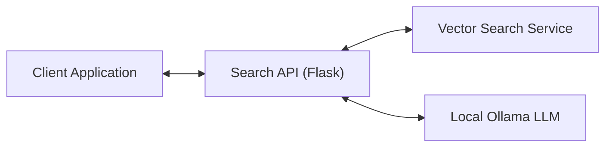
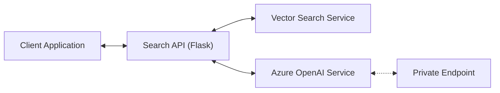

# SEARCH-API Documentation

## Overview

The Search-API is a Flask-based REST API service that implements a Retrieval-Augmented Generation (RAG) pattern. It provides a bridge between user queries, an external vector search service, and an LLM (Language Learning Model) to generate contextually relevant responses.

## Architecture

The service follows a modular architecture with the following key components:

1. **REST API Layer**: Handles incoming HTTP requests and responses
2. **Search Service**: Coordinates the search flow between vector search and LLM synthesis
3. **Synthesizer**: Manages LLM integration, prompt creation, and response formatting
4. **External Vector Search**: Retrieves relevant document information based on user queries

## Component Diagram

The service architecture supports two LLM provider options:

### Option 1: Local Development with Ollama



### Option 2: Azure OpenAI Integration



## Workflow

1. Client sends a search query through REST API
2. Search Service forwards the query to the external Vector Search service
3. Vector Search service returns relevant document information
4. Search Service formats the documents and creates a prompt for the LLM
5. Based on configuration:
   - **Ollama**: Local Ollama instance processes the prompt
   - **Azure OpenAI**: Request is sent through private endpoint to Azure OpenAI
6. Search Service formats the response and returns it to the client with document information and performance metrics

## API Endpoints

### POST /api/search

Processes a search query and returns relevant documents with an LLM-generated summary.

**Request:**

```json
{
  "question": "What is the environmental impact of the project?"
}
```

**Response:**

```json
{
  "result": {
    "response": "LLM-generated summary based on the documents",
    "documents": [
      {
        "document_id": "123",
        "document_name": "Environmental Assessment Report",
        "document_type": "Report",
        "content": "Document content excerpt...",
        "page_number": "45",
        "project_id": "P-123",
        "project_name": "Example Project"
      }
    ],
    "metrics": {
      "start_time": "2025-05-15 14:30:45 UTC",
      "get_synthesizer_time": 12.34,
      "search_time_ms": 234.56,
      "search_breakdown": { /* detailed search metrics */ },
      "llm_time_ms": 345.67,
      "total_time_ms": 592.57
    }
  }
}
```

## Configuration

### Azure OpenAI Configuration

The service now supports Azure OpenAI with private endpoint access. Configuration includes:

| Variable | Description | Default |
|----------|-------------|---------|
| LLM_PROVIDER | LLM provider selection | openai |
| AZURE_OPENAI_API_KEY | Azure OpenAI API key | - |
| AZURE_OPENAI_ENDPOINT | Azure OpenAI endpoint URL | - |
| AZURE_OPENAI_DEPLOYMENT | Model deployment name (e.g., gpt-4, gpt-35-turbo) | - |
| AZURE_OPENAI_API_VERSION | API version for Azure OpenAI endpoints | 2024-02-15-preview |

### Private Endpoint Access

The service is configured to access Azure OpenAI through a private endpoint, ensuring secure communication within the Azure virtual network. This requires:

1. The application must be deployed within the same VNet as the Azure OpenAI private endpoint
2. DNS resolution must be configured to resolve the privatelink.openai.azure.com domain
3. Network security groups must allow traffic between the application and the private endpoint

### Environment Variables

| Variable | Description | Default |
|----------|-------------|---------|
| VECTOR_SEARCH_API_URL | URL for the external vector search service |  |
| LLM_HOST | Host address for the LLM service |  |
| LLM_MODEL | Ollama model to use | qwen2.5:0.5b |
| LLM_TEMPERATURE | Temperature parameter for LLM generation | 0.3 |
| LLM_MAX_TOKENS | Maximum tokens for LLM response | 150 |
| LLM_MAX_CONTEXT_LENGTH | Maximum context length for LLM | 4096 |

## Extendability

The Search API is designed to be extensible in the following ways:

1. **LLM Provider Architecture**: The service uses a modular synthesizer architecture:
   - Abstract `LLMSynthesizer` base class defines the interface
   - `OllamaSynthesizer` implements local LLM integration
   - `AzureOpenAISynthesizer` implements Azure OpenAI integration
   - Additional providers can be added by implementing the base class

2. **Customized Prompts**: The prompt template can be modified in the `LLMSynthesizer` class to adjust how the LLM interprets and responds to queries.

3. **Response Formatting**: Each synthesizer implementation can customize response formatting while maintaining a consistent interface.

## Performance and Security Considerations

### Security Best Practices

1. API Key Management
   - Store API keys and secrets securely using environment variables or a secrets management service
   - Never commit API keys or sensitive credentials to version control
   - Rotate API keys periodically according to your security policy

2. Network Security
   - Use private endpoints for Azure OpenAI access to ensure traffic stays within your virtual network
   - Configure Network Security Groups (NSGs) to restrict traffic between application and services
   - Enable TLS/SSL for all external communications
   - Implement proper CORS policies to restrict cross-origin requests

3. Access Control
   - Implement authentication for all API endpoints
   - Use role-based access control (RBAC) to limit access to sensitive operations
   - Validate and sanitize all user inputs
   - Implement rate limiting to prevent abuse

### Performance Optimization

- The service collects detailed performance metrics at each step for monitoring and optimization
- Timeouts are configured for external service calls to prevent hanging requests
- Error handling ensures graceful degradation when services are unavailable
- Consider implementing caching for frequently requested queries

## Dependencies

Core Dependencies:

- **Flask**: Web framework for the REST API
- **Requests**: HTTP client for external service communication

LLM Provider Dependencies:

- **Ollama**: Integration with local LLMs for development
- **OpenAI**: Azure OpenAI client library for production

## Future Enhancements

- Response caching for frequently requested queries
- Enhanced retry mechanisms with exponential backoff
- Performance optimizations and monitoring dashboards
- Support for additional LLM providers
- Streaming responses for long-running queries
