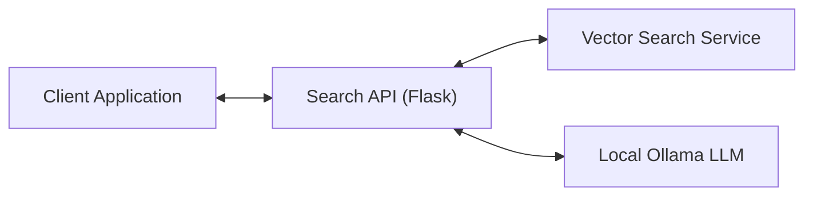
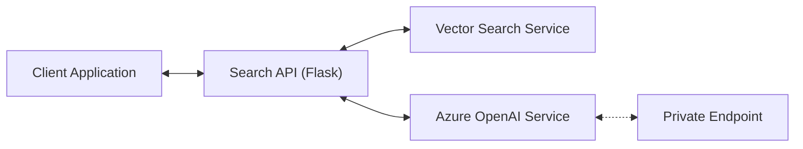

# SEARCH-API Documentation

## Overview

The Search-API is a Flask-based REST API service that implements a Retrieval-Augmented Generation (RAG) pattern. It provides a bridge between user queries, an external vector search service, and an LLM (Language Learning Model) to generate contextually relevant responses.

## Architecture

The service follows a modular architecture with the following key components:

1. **REST API Layer**: Handles incoming HTTP requests and responses
2. **Search Service**: Coordinates the search flow between vector search and LLM synthesis
3. **Synthesizer**: Manages LLM integration, prompt creation, and response formatting
4. **External Vector Search**: Retrieves relevant document information based on user queries

## Component Diagram

The service architecture supports two LLM provider options:

### Option 1: Local Development with Ollama



### Option 2: Azure OpenAI Integration



## Workflow

1. Client sends a search query through REST API
2. Search Service forwards the query to the external Vector Search service
3. Vector Search service returns relevant document information
4. Search Service formats the documents and creates a prompt for the LLM
5. Based on configuration:
   - **Ollama**: Local Ollama instance processes the prompt
   - **Azure OpenAI**: Request is sent through private endpoint to Azure OpenAI
6. Search Service formats the response and returns it to the client with document information and performance metrics

## API Endpoints

### GET /api/document/view

Retrieves and displays a PDF document stored in S3.

**Query Parameters:**

- `key` - (Required) The S3 key of the document, URL encoded
- `file_name` - (Required) The filename to display in the browser, URL encoded

**Example Request:**

```code
GET /api/document/view?key=path%2Fto%2Fdocument.pdf&file_name=document.pdf
```

**Authentication:**

- Currently disabled for development, but will require standard authentication headers when re-enabled
- The @auth.require decorator will be used to enforce authentication

**Response:**

- Content-Type: application/pdf
- Content-Disposition: inline; filename="document.pdf"
- Body: Binary PDF data
- Cache-Control headers for optimal browser caching

**Error Responses:**

- 400 Bad Request - Missing required parameters
- 404 Not Found - Document not found or inaccessible
- 500 Internal Server Error - Server error

### POST /api/search/query

Processes a search query and returns relevant documents with an LLM-generated summary.

**Request:**

```json
{
  "question": "What is the environmental impact of the project?",
  "projectIds": ["P-123"],
  "documentTypeIds": ["doc-type-1", "doc-type-2"],
  "inference": ["PROJECT", "DOCUMENTTYPE"],
  "ranking": {
    "minScore": 0.7,
    "topN": 10
  },
  "searchStrategy": "HYBRID_PARALLEL"
}
```

**Request Parameters:**

- `question` (string, required): The search query
- `projectIds` (array, optional): List of project IDs to filter search results by. If not provided, searches across all projects
- `documentTypeIds` (array, optional): List of document type IDs to filter search results by. If not provided, searches across all document types
- `inference` (array, optional): List of inference types to enable (e.g., ["PROJECT", "DOCUMENTTYPE"]). If not provided, uses the vector search API's default inference settings
- `ranking` (object, optional): Ranking configuration with keys like 'minScore' and 'topN'. If not provided, uses the vector search API's default ranking settings
- `searchStrategy` (string, optional): Search strategy to use. Available options:
  - `HYBRID_SEMANTIC_FALLBACK` (default): Document-level filtering → semantic search → semantic fallback → keyword fallback. Best for general-purpose queries with balanced efficiency and accuracy
  - `HYBRID_KEYWORD_FALLBACK`: Document-level filtering → keyword search → keyword fallback → semantic fallback. Best for queries with specific technical terms and exact phrase matching
  - `SEMANTIC_ONLY`: Pure semantic search without document-level filtering or keyword fallbacks. Best for conceptual queries when exact keyword matches aren't important
  - `KEYWORD_ONLY`: Pure keyword search without semantic components. Best for exact term matching and fastest performance
  - `HYBRID_PARALLEL`: Runs both semantic and keyword searches simultaneously then merges results. Best for maximum recall when computational cost is not a concern

**Response:**

```json
{
  "result": {
    "response": "LLM-generated summary based on the documents",
    "documents": [
      {
        "document_id": "123",
        "document_name": "Environmental Assessment Report",
        "document_type": "Report",
        "content": "Document content excerpt...",
        "page_number": "45",
        "project_id": "P-123",
        "project_name": "Example Project"
      }
    ],
    "metrics": {
      "start_time": "2025-07-17 14:30:45 UTC",
      "get_synthesizer_time": 12.34,
      "llm_provider": "openai",
      "llm_model": "gpt-41-nano",
      "search_time_ms": 234.56,
      "search_breakdown": {
        "search_strategy": "HYBRID_PARALLEL",
        "search_query": "environmental impact",
        "project_filter_applied": true,
        "document_type_filter_applied": false,
        "document_search_ms": 45.2,
        "semantic_search_ms": 123.4,
        "keyword_search_ms": 89.1,
        "reranking_ms": 67.8,
        "total_search_ms": 325.5
      },
      "llm_time_ms": 345.67,
      "total_time_ms": 592.57,
      "search_quality": "normal",
      "original_query": "What is the environmental impact of the project?",
      "final_semantic_query": "environmental impact project",
      "semantic_cleaning_applied": true,
      "search_mode": "hybrid_parallel",
      "query_processed": true,
      "inference_settings": {
        "use_default_inference": true,
        "project_inference_enabled": true,
        "document_type_inference_enabled": true
      }
    },
    "search_quality": "normal",
    "project_inference": {
      "attempted": true,
      "confidence": 0.95,
      "inferred_project_ids": ["P-123"],
      "applied": true
    },
    "document_type_inference": {
      "attempted": true,
      "confidence": 0.85,
      "inferred_document_type_ids": ["doc-type-1"],
      "applied": true
    }
  }
}
```

### POST /api/search/similar

Finds documents similar to a given document using document-level embeddings.

**Request:**

```json
{
  "documentId": "65130ee0381111002240b89e",
  "projectIds": ["P-123"],
  "limit": 5
}
```

**Response:**

```json
{
  "result": {
    "source_document_id": "65130ee0381111002240b89e",
    "documents": [
      {
        "document_id": "651c37412c14e00022713dad",
        "document_keywords": ["shared lheidli", "environmental assessment"],
        "document_tags": ["Employment", "Communities"],
        "document_headings": [],
        "project_id": "650b5adc5d77c20022fb59fc",
        "similarity_score": 0.8553,
        "created_at": "2025-07-07T20:24:32.738719+00:00"
      }
      // ... more similar documents ...
    ],
    "metrics": {
      "start_time": "2025-07-10 12:00:00 UTC",
      "search_time_ms": 114.24,
      "search_breakdown": { /* detailed timing */ },
      "total_time_ms": 120.00
    }
  }
}
```

### GET/POST /api/stats/processing

Returns processing statistics for all projects (GET) or for specific projects (POST with `projectIds`).

**Response:**

```json
{
  "result": {
    "processing_stats": { /* stats data */ },
    "metrics": { /* timing and meta info */ }
  }
}
```

### GET /api/stats/project/<project_id>

Returns detailed processing logs for a specific project.

**Response:**

```json
{
  "result": {
    "project_details": { /* project log data */ },
    "metrics": { /* timing and meta info */ }
  }
}
```

### GET /api/stats/summary

Returns a high-level processing summary across the entire system.

**Response:**

```json
{
  "result": {
    "system_summary": { /* summary data */ },
    "metrics": { /* timing and meta info */ }
  }
}
```

## Search Strategies

The API supports multiple configurable search strategies that can be specified using the `searchStrategy` parameter in search requests. Each strategy optimizes for different use cases and performance characteristics.

### HYBRID_SEMANTIC_FALLBACK (Default)

**Description**: The balanced approach implementing document-level filtering followed by semantic search with fallback mechanisms.

**Flow**:

1. **Document-Level Keyword Filtering**: Uses pre-computed document metadata (keywords, tags, headings) to identify relevant documents
2. **Chunk-Level Semantic Search**: Performs semantic vector search within chunks of identified documents
3. **Semantic Fallback**: If no documents found, searches all chunks semantically
4. **Keyword Fallback**: Final fallback to keyword search if semantic approaches fail

**Best For**: General-purpose queries, balanced efficiency and accuracy

**Usage**:

```json
{
  "question": "What are the environmental impacts?",
  "searchStrategy": "HYBRID_SEMANTIC_FALLBACK"
}
```

### HYBRID_KEYWORD_FALLBACK

**Description**: Similar to the default but prioritizes keyword matching over semantic search.

**Flow**:

1. **Document-Level Keyword Filtering**: Same as default strategy
2. **Chunk-Level Keyword Search**: Performs keyword search within chunks of identified documents
3. **Keyword Fallback**: If no documents found, searches all chunks with keywords
4. **Semantic Fallback**: Final fallback to semantic search if keyword approaches fail

**Best For**: Queries with specific technical terms, exact phrase matching

**Usage**:

```json
{
  "question": "carbon dioxide emissions monitoring",
  "searchStrategy": "HYBRID_KEYWORD_FALLBACK"
}
```

### SEMANTIC_ONLY

**Description**: Pure semantic search without document-level filtering or keyword fallbacks.

**Flow**:

1. **Direct Semantic Search**: Semantic vector search across all chunks
2. **Cross-Encoder Re-ranking**: Re-ranks all semantic results

**Best For**: Conceptual queries, when exact keyword matches aren't important

**Usage**:

```json
{
  "question": "What are the community concerns?",
  "searchStrategy": "SEMANTIC_ONLY"
}
```

### KEYWORD_ONLY

**Description**: Pure keyword search without semantic components.

**Flow**:

1. **Direct Keyword Search**: Keyword search across all chunks using PostgreSQL full-text search
2. **Cross-Encoder Re-ranking**: Re-ranks all keyword results

**Best For**: Exact term matching, fastest performance, queries with specific terminology

**Usage**:

```json
{
  "question": "section 11 environmental assessment",
  "searchStrategy": "KEYWORD_ONLY"
}
```

### HYBRID_PARALLEL

**Description**: Comprehensive search running both semantic and keyword approaches simultaneously.

**Flow**:

1. **Parallel Execution**: Runs both semantic and keyword searches across all chunks in parallel threads
2. **Result Merging**: Combines results from both searches, removing duplicates
3. **Cross-Encoder Re-ranking**: Re-ranks the merged result set

**Best For**: Maximum recall, when computational cost is not a concern

**Usage**:

```json
{
  "question": "wildlife habitat protection measures",
  "searchStrategy": "HYBRID_PARALLEL"
}
```

### Strategy Selection Guidelines

- **Use HYBRID_SEMANTIC_FALLBACK** for most general queries where you want balanced performance and accuracy
- **Use HYBRID_KEYWORD_FALLBACK** when searching for specific technical terms, regulatory references, or exact phrases
- **Use SEMANTIC_ONLY** for conceptual or thematic queries where understanding context is more important than exact matches
- **Use KEYWORD_ONLY** for fastest performance when you need exact term matching
- **Use HYBRID_PARALLEL** when you need maximum recall and computational resources allow for parallel processing

### Metrics and Monitoring

All search strategies include detailed timing metrics in the response:

- Strategy identification and source (default vs. request-specified)
- Per-component timing (document filtering, semantic search, keyword search, re-ranking)
- Filtering statistics (total chunks, excluded chunks, score ranges)
- Inference timing and breakdown

## Configuration

### Azure OpenAI Configuration

The service now supports Azure OpenAI with private endpoint access. Configuration includes:

| Variable | Description | Default |
|----------|-------------|---------|
| LLM_PROVIDER | LLM provider selection | openai |
| AZURE_OPENAI_API_KEY | Azure OpenAI API key | - |
| AZURE_OPENAI_ENDPOINT | Azure OpenAI endpoint URL | - |
| AZURE_OPENAI_DEPLOYMENT | Model deployment name (e.g., gpt-4, gpt-35-turbo) | - |
| AZURE_OPENAI_API_VERSION | API version for Azure OpenAI endpoints | 2024-02-15-preview |

### Private Endpoint Access

The service is configured to access Azure OpenAI through a private endpoint, ensuring secure communication within the Azure virtual network. This requires:

1. The application must be deployed within the same VNet as the Azure OpenAI private endpoint
2. DNS resolution must be configured to resolve the privatelink.openai.azure.com domain
3. Network security groups must allow traffic between the application and the private endpoint

### Environment Variables

| Variable | Description | Default |
|----------|-------------|---------|
| VECTOR_SEARCH_API_URL | URL for the external vector search service |  |
| LLM_HOST | Host address for the LLM service |  |
| LLM_MODEL | Ollama model to use | qwen2.5:0.5b |
| LLM_TEMPERATURE | Temperature parameter for LLM generation | 0.3 |
| LLM_MAX_TOKENS | Maximum tokens for LLM response | 150 |
| LLM_MAX_CONTEXT_LENGTH | Maximum context length for LLM | 4096 |
| LLM_SYSTEM_MESSAGE | System prompt for the LLM (system message for Azure OpenAI, controls LLM behavior and tone) | 'You are an AI assistant for employees in FAQ system. Your task is to synthesize coherent and helpful answers based on the given question and relevant context from a knowledge database.' |
| S3_BUCKET | Name of the S3 bucket containing documents |  |
| S3_ACCESS_KEY_ID | AWS access key ID for S3 access |  |
| S3_SECRET_ACCESS_KEY | AWS secret access key for S3 access |  |
| S3_HOST | S3 endpoint host |  |
| S3_REGION | AWS region for S3 bucket |  |
| S3_SERVICE | Service name (default: s3) | s3 |

## Extendability

The Search API is designed to be extensible in the following ways:

1. **LLM Provider Architecture**: The service uses a modular synthesizer architecture:
   - Abstract `LLMSynthesizer` base class defines the interface
   - `OllamaSynthesizer` implements local LLM integration
   - `AzureOpenAISynthesizer` implements Azure OpenAI integration
   - Additional providers can be added by implementing the base class

2. **Customized Prompts**: The prompt template can be modified in the `LLMSynthesizer` class to adjust how the LLM interprets and responds to queries.

3. **Response Formatting**: Each synthesizer implementation can customize response formatting while maintaining a consistent interface.

## Performance and Security Considerations

### Security Best Practices

1. API Key Management
   - Store API keys and secrets securely using environment variables or a secrets management service
   - Never commit API keys or sensitive credentials to version control
   - Rotate API keys periodically according to your security policy

2. Network Security
   - Use private endpoints for Azure OpenAI access to ensure traffic stays within your virtual network
   - Configure Network Security Groups (NSGs) to restrict traffic between application and services
   - Enable TLS/SSL for all external communications
   - Implement proper CORS policies to restrict cross-origin requests

3. Access Control
   - Implement authentication for all API endpoints
   - Use role-based access control (RBAC) to limit access to sensitive operations
   - Validate and sanitize all user inputs
   - Implement rate limiting to prevent abuse

### Performance Optimization

- The service collects detailed performance metrics at each step for monitoring and optimization
- Timeouts are configured for external service calls to prevent hanging requests
- Error handling ensures graceful degradation when services are unavailable
- Consider implementing caching for:
  - Frequently requested search queries
  - Document downloads from S3, especially for frequently accessed PDFs
  - Use appropriate cache headers for PDF downloads to enable browser caching

## Dependencies

Core Dependencies:

- **Flask**: Web framework for the REST API
- **Requests**: HTTP client for external service communication

LLM Provider Dependencies:

- **Ollama**: Integration with local LLMs for development
- **OpenAI**: Azure OpenAI client library for production

## Future Enhancements

- Response caching for frequently requested queries
- Enhanced retry mechanisms with exponential backoff
- Performance optimizations and monitoring dashboards
- Support for additional LLM providers
- Streaming responses for long-running queries
