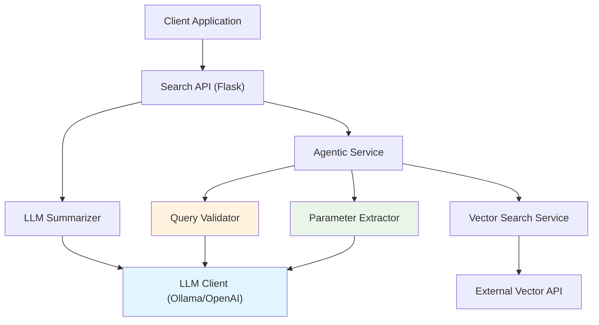
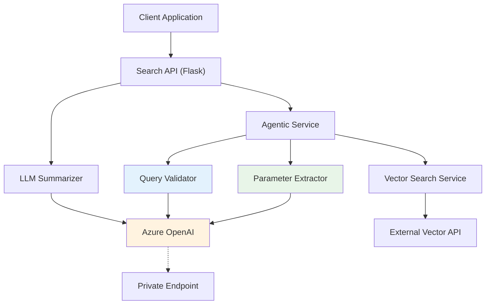
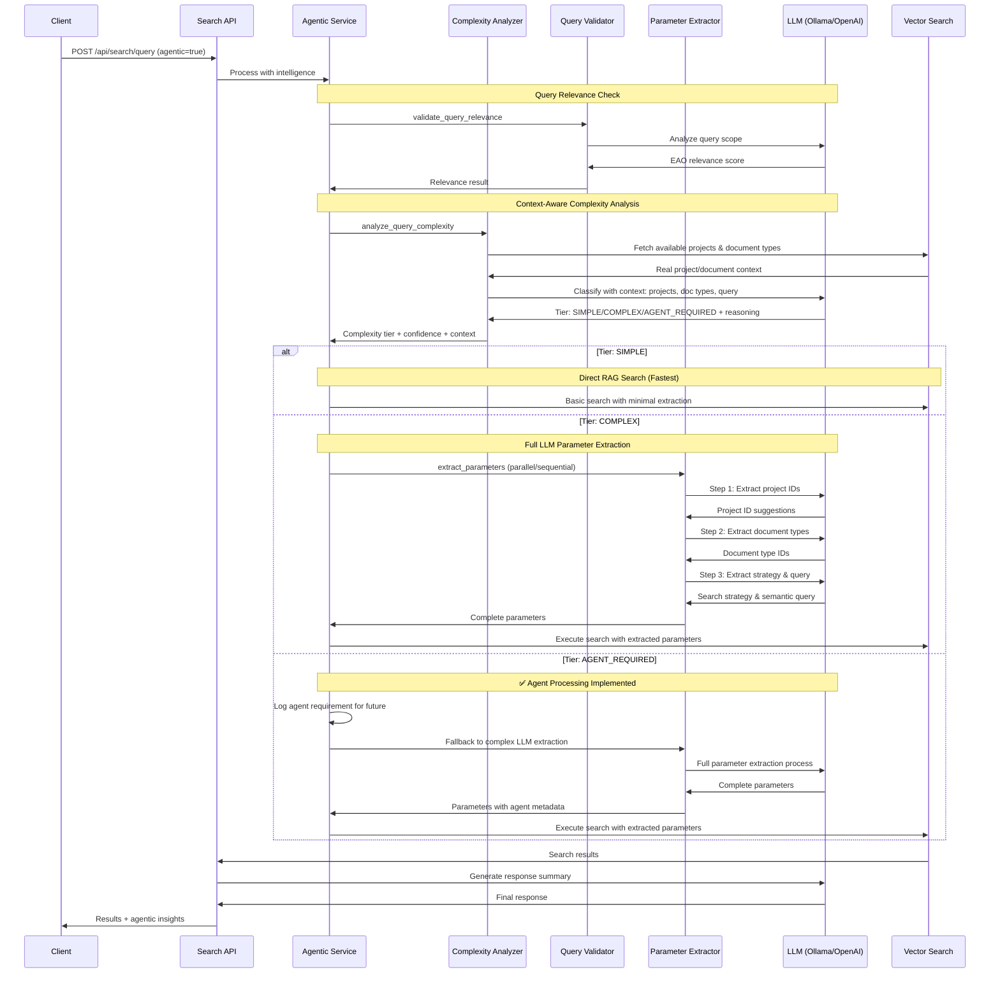

# SEARCH-API Documentation

## Overview

The Search-API is a Flask-based REST API service that implements a Retrieval-Augmented Generation (RAG) pattern. It provides a bridge between user queries, an external vector search service, and an LLM (Language Learning Model) to generate contextually relevant responses.

## Architecture

The service follows a modular architecture with the following key components:

1. **REST API Layer**: Handles incoming HTTP requests and responses
2. **Search Service**: Coordinates the search flow between vector search and LLM synthesis
3. **Agentic Service**: Orchestrates AI-powered query analysis and optimization using direct LLM calls
4. **LLM Integration**: Provides intelligent query processing using LLMs for parameter extraction and validation
5. **Generation Services**: Manages LLM integration for response generation and agentic processing
6. **External Vector Search**: Retrieves relevant document information based on processed queries

### Environment-Aware Architecture

The system automatically adapts based on deployment environment:

#### Local Development Architecture

- **LLM Mode**: Direct client integration
- **LLM Provider**: Ollama (local models) or OpenAI
- **Use Case**: Development, debugging, experimentation

#### Production/Azure Architecture

- **LLM Mode**: Direct client integration
- **LLM Provider**: Azure OpenAI
- **Use Case**: Scalable cloud deployment

The Search API provides intelligent parameter extraction and query validation through a modular generation services architecture with support for multiple LLM providers.

**Key Generation Services:**

- **Parameter Extractor**: Multi-step extraction for project IDs, document types, and search strategy
- **Query Validator**: LLM-powered validation for query relevance and scope
- **Summarizer**: Response synthesis and document summarization

For deployment configuration across different environments, see the **[Deployment Guide](#deployment-guide)** section below.

## Component Diagram

The service architecture supports environment-aware deployment with intelligent agentic processing:

### Local Development Architecture (Ollama/OpenAI + Direct LLM Integration)



### Production/Azure Architecture (Azure OpenAI + Direct LLM Integration)



### Agentic Processing Flow



## Workflow

The Search API supports both traditional and agentic workflow modes:

### Traditional Workflow

1. Client sends a search query through REST API
2. Search Service forwards the query directly to the external Vector Search service
3. Vector Search service returns relevant document information
4. Search Service formats the documents and creates a prompt for the LLM
5. Based on configuration:
   - **Local Development**: Ollama processes the prompt for response synthesis
   - **Azure Production**: Azure OpenAI processes the prompt through private endpoint
6. Search Service formats the response and returns it to the client with document information and performance metrics

### Enhanced Agentic Workflow (agentic=true)

The agentic workflow now includes intelligent execution planning with parallel processing and LLM-based result validation:

#### **Phase 1: Query Processing & Planning**

1. **Query Relevance Validation**: LLM validates if query is EAO-related and provides scope guidance
2. **Execution Plan Generation**: LLM creates intelligent multi-step execution plan with:
   - Dynamic step generation based on query complexity
   - Parallel search optimization for multiple document types/projects
   - Intelligent tool selection (validate_query_relevance, get_projects_list, get_document_types, search, validate_chunks_relevance, verify_reduce, consolidate_results, summarize_results)

#### **Phase 2: Parameter Discovery & Enhancement**

1. **Project Discovery**: LLM extracts and validates project IDs using fuzzy matching
2. **Document Type Discovery**: LLM identifies relevant document types via comprehensive alias search
3. **Search Strategy Optimization**: LLM determines optimal search approach and creates semantic queries

#### **Phase 3: Parallel Search Execution**

1. **Multi-Vector Search**: Executes multiple targeted searches simultaneously:
   - Parallel search execution for different document types
   - Parallel search execution for different query aspects
   - Context-aware parameter enhancement for each search

#### **Phase 4: LLM-Powered Result Validation** ⭐ **NEW**

1. **Chunk Relevance Validation**: LLM validates each search result for relevance:
   - **Tool**: `validate_chunks_relevance`
   - **Process**: Sends structured chunks to LLM for relevance scoring
   - **Output**: Filtered results with validation metrics and reasoning
   - **Logging**: Shows only structured content sent to LLM (first 100 chars per chunk)

#### **Phase 5: Verification & Consolidation** ⭐ **NEW**

1. **Verified Chunk Collection**: `verify_reduce` tool collects validated chunks:
   - **Clean Logging**: Shows only essential filter steps, not massive execution context
   - **Chunk Tracking**: Reports chunks kept/removed by document name
   - **Format**: `🔗 CHUNKS KEPT (N): doc1.pdf, doc2.pdf...` and `🔗 CHUNKS REMOVED (N): doc3.pdf...`
2. **Result Consolidation**: Merges and deduplicates verified chunks
3. **Response Synthesis**: LLM generates comprehensive summary from validated results

#### **Enhanced Features**

- **Parallel Execution**: Search and validation steps run in parallel groups for optimal performance
- **Context Management**: Clean parameter passing prevents execution context pollution in logs
- **Intelligent Filtering**: LLM removes irrelevant chunks before final consolidation
- **Transparent Logging**: Clear visibility into validation decisions and chunk filtering
- **Robust Error Handling**: JSON repair and salvage for malformed LLM responses
- **Token Optimization**: Increased limits (1200-3500 tokens) to handle complex execution plans

#### **Environment Integration**

- **Local Development**: All LLM operations (planning + validation + synthesis) use Ollama
- **Azure Production**: All LLM operations use Azure OpenAI for enterprise performance
- **Automatic Detection**: Environment-aware LLM provider selection

### Environment-Aware LLM Integration

- **Local Development**: All LLM calls (agentic + synthesis) use Ollama for consistent local experience
- **Azure Production**: All LLM calls (agentic + synthesis) use Azure OpenAI for enterprise-grade performance
- **Automatic Detection**: Environment detection ensures appropriate LLM provider without manual configuration

## API Endpoints

### GET /api/document/view

Retrieves and displays a PDF document stored in S3.

**Query Parameters:**

- `key` - (Required) The S3 key of the document, URL encoded
- `file_name` - (Required) The filename to display in the browser, URL encoded

**Example Request:**

```code
GET /api/document/view?key=path%2Fto%2Fdocument.pdf&file_name=document.pdf
```

**Authentication:**

- **REQUIRED**: All API endpoints require JWT authentication via OIDC
- Authentication uses the `@auth.require` decorator on all protected endpoints
- Health/readiness endpoints (`/healthz`, `/readyz`) remain public for monitoring
- Bearer token format: `Authorization: Bearer <jwt-token>`
- OIDC Configuration:
  - **Dev Environment**: `https://dev.loginproxy.gov.bc.ca/auth/realms/eao-epic`
  - **Test Environment**: `https://test.loginproxy.gov.bc.ca/auth/realms/eao-epic`
  - **Expected Audience**: `epic-search` or `account`
  - **Client ID**: `epic-search`

**Response:**

- Content-Type: application/pdf
- Content-Disposition: inline; filename="document.pdf"
- Body: Binary PDF data
- Cache-Control headers for optimal browser caching

**Error Responses:**

- 400 Bad Request - Missing required parameters
- 404 Not Found - Document not found or inaccessible
- 500 Internal Server Error - Server error

### POST /api/search/query

Processes a search query and returns relevant documents with an LLM-generated summary.

**Request:**

```json
{
  "query": "What is the environmental impact of the project?",
  "projectIds": ["P-123"],
  "documentTypeIds": ["doc-type-1", "doc-type-2"],
  "inference": ["PROJECT", "DOCUMENTTYPE"],
  "ranking": {
    "minScore": 0.7,
    "topN": 10
  },
  "searchStrategy": "HYBRID_PARALLEL",
  "agentic": true,
  "userLocation": {
    "city": "Victoria",
    "region": "British Columbia",
    "latitude": 48.4284,
    "longitude": -123.3656
  }
}
```

**Request Parameters:**

- `query` (string, required): The search query
- `projectIds` (array, optional): List of project IDs to filter search results by. If not provided, searches across all projects
- `documentTypeIds` (array, optional): List of document type IDs to filter search results by. If not provided, searches across all document types
- `inference` (array, optional): List of inference types to enable (e.g., ["PROJECT", "DOCUMENTTYPE"]). If not provided, uses the vector search API's default inference settings
- `ranking` (object, optional): Ranking configuration with keys like 'minScore' and 'topN'. If not provided, uses the vector search API's default ranking settings
- `searchStrategy` (string, optional): Search strategy to use. Available options:
  - `HYBRID_SEMANTIC_FALLBACK` (default): Document-level filtering → semantic search → semantic fallback → keyword fallback. Best for general-purpose queries with balanced efficiency and accuracy
  - `HYBRID_KEYWORD_FALLBACK`: Document-level filtering → keyword search → keyword fallback → semantic fallback. Best for queries with specific technical terms and exact phrase matching
  - `SEMANTIC_ONLY`: Pure semantic search without document-level filtering or keyword fallbacks. Best for conceptual queries when exact keyword matches aren't important
  - `KEYWORD_ONLY`: Pure keyword search without semantic components. Best for exact term matching and fastest performance
  - `HYBRID_PARALLEL`: Runs both semantic and keyword searches simultaneously then merges results. Best for maximum recall when computational cost is not a concern
- `agentic` (boolean, optional): Enable intelligent agent-based processing with enhanced query analysis and tool execution
- `userLocation` (object, optional): User location for location-aware query enhancement. Used for "local", "near me" queries. Contains:
  - `city` (string, optional): User's city name
  - `region` (string, optional): User's region/province
  - `latitude` (number, optional): User's latitude coordinate
  - `longitude` (number, optional): User's longitude coordinate

**Response:**

```json
{
  "result": {
    "response": "LLM-generated summary based on the documents",
    "documents": [
      {
        "document_id": "123",
        "document_name": "Environmental Assessment Report",
        "document_type": "Report",
        "content": "Document content excerpt...",
        "page_number": "45",
        "project_id": "P-123",
        "project_name": "Example Project"
      }
    ],
    "metrics": {
      "start_time": "2025-07-17 14:30:45 UTC",
      "get_synthesizer_time": 12.34,
      "llm_provider": "openai",
      "llm_model": "gpt-41-nano",
      "search_time_ms": 234.56,
      "search_breakdown": {
        "search_strategy": "HYBRID_PARALLEL",
        "search_query": "environmental impact",
        "project_filter_applied": true,
        "document_type_filter_applied": false,
        "document_search_ms": 45.2,
        "semantic_search_ms": 123.4,
        "keyword_search_ms": 89.1,
        "reranking_ms": 67.8,
        "total_search_ms": 325.5
      },
      "llm_time_ms": 345.67,
      "total_time_ms": 592.57,
      "search_quality": "normal",
      "original_query": "What is the environmental impact of the project?",
      "final_semantic_query": "environmental impact project",
      "semantic_cleaning_applied": true,
      "search_mode": "hybrid_parallel",
      "query_processed": true,
      "inference_settings": {
        "use_default_inference": true,
        "project_inference_enabled": true,
        "document_type_inference_enabled": true
      }
    },
    "search_quality": "normal",
    "project_inference": {
      "attempted": true,
      "confidence": 0.95,
      "inferred_project_ids": ["P-123"],
      "applied": true
    },
    "document_type_inference": {
      "attempted": true,
      "confidence": 0.85,
      "inferred_document_type_ids": ["doc-type-1"],
      "applied": true
    }
  }
}
```

### POST /api/search/document-similarity

Finds documents similar to a given document using document-level embeddings.

**Request:**

```json
{
  "documentId": "65130ee0381111002240b89e",
  "projectIds": ["P-123"],
  "limit": 5
}
```

**Response:**

```json
{
  "result": {
    "source_document_id": "65130ee0381111002240b89e",
    "documents": [
      {
        "document_id": "651c37412c14e00022713dad",
        "document_keywords": ["shared lheidli", "environmental assessment"],
        "document_tags": ["Employment", "Communities"],
        "document_headings": [],
        "project_id": "650b5adc5d77c20022fb59fc",
        "similarity_score": 0.8553,
        "created_at": "2025-07-07T20:24:32.738719+00:00"
      }
      // ... more similar documents ...
    ],
    "metrics": {
      "start_time": "2025-07-10 12:00:00 UTC",
      "search_time_ms": 114.24,
      "search_breakdown": { /* detailed timing */ },
      "total_time_ms": 120.00
    }
  }
}
```

### GET /api/stats/processing

Returns processing statistics for all projects.

**Response:**

```json
{
  "result": {
    "processing_stats": { /* stats data */ },
    "metrics": { /* timing and meta info */ }
  }
}
```

### GET /api/stats/processing/<project_id>

Returns detailed processing logs for a specific project.

**Response:**

```json
{
  "result": {
    "project_details": { /* project log data */ },
    "metrics": { /* timing and meta info */ }
  }
}
```

### GET /api/stats/summary

Returns a high-level processing summary across the entire system.

**Response:**

```json
{
  "result": {
    "system_summary": { /* summary data */ },
    "metrics": { /* timing and meta info */ }
  }
}
```

## Search Strategies

The API supports multiple configurable search strategies that can be specified using the `searchStrategy` parameter in search requests. Each strategy optimizes for different use cases and performance characteristics.

### HYBRID_SEMANTIC_FALLBACK (Default)

**Description**: The balanced approach implementing document-level filtering followed by semantic search with fallback mechanisms.

**Flow**:

1. **Document-Level Keyword Filtering**: Uses pre-computed document metadata (keywords, tags, headings) to identify relevant documents
2. **Chunk-Level Semantic Search**: Performs semantic vector search within chunks of identified documents
3. **Semantic Fallback**: If no documents found, searches all chunks semantically
4. **Keyword Fallback**: Final fallback to keyword search if semantic approaches fail

**Best For**: General-purpose queries, balanced efficiency and accuracy

**Usage**:

```json
{
  "query": "What are the environmental impacts?",
  "searchStrategy": "HYBRID_SEMANTIC_FALLBACK"
}
```

### HYBRID_KEYWORD_FALLBACK

**Description**: Similar to the default but prioritizes keyword matching over semantic search.

**Flow**:

1. **Document-Level Keyword Filtering**: Same as default strategy
2. **Chunk-Level Keyword Search**: Performs keyword search within chunks of identified documents
3. **Keyword Fallback**: If no documents found, searches all chunks with keywords
4. **Semantic Fallback**: Final fallback to semantic search if keyword approaches fail

**Best For**: Queries with specific technical terms, exact phrase matching

**Usage**:

```json
{
  "query": "carbon dioxide emissions monitoring",
  "searchStrategy": "HYBRID_KEYWORD_FALLBACK"
}
```

### SEMANTIC_ONLY

**Description**: Pure semantic search without document-level filtering or keyword fallbacks.

**Flow**:

1. **Direct Semantic Search**: Semantic vector search across all chunks
2. **Cross-Encoder Re-ranking**: Re-ranks all semantic results

**Best For**: Conceptual queries, when exact keyword matches aren't important

**Usage**:

```json
{
  "query": "What are the community concerns?",
  "searchStrategy": "SEMANTIC_ONLY"
}
```

### KEYWORD_ONLY

**Description**: Pure keyword search without semantic components.

**Flow**:

1. **Direct Keyword Search**: Keyword search across all chunks using PostgreSQL full-text search
2. **Cross-Encoder Re-ranking**: Re-ranks all keyword results

**Best For**: Exact term matching, fastest performance, queries with specific terminology

**Usage**:

```json
{
  "query": "section 11 environmental assessment",
  "searchStrategy": "KEYWORD_ONLY"
}
```

### HYBRID_PARALLEL

**Description**: Comprehensive search running both semantic and keyword approaches simultaneously.

**Flow**:

1. **Parallel Execution**: Runs both semantic and keyword searches across all chunks in parallel threads
2. **Result Merging**: Combines results from both searches, removing duplicates
3. **Cross-Encoder Re-ranking**: Re-ranks the merged result set

**Best For**: Maximum recall, when computational cost is not a concern

**Usage**:

```json
{
  "query": "wildlife habitat protection measures",
  "searchStrategy": "HYBRID_PARALLEL"
}
```

### Strategy Selection Guidelines

- **Use HYBRID_SEMANTIC_FALLBACK** for most general queries where you want balanced performance and accuracy
- **Use HYBRID_KEYWORD_FALLBACK** when searching for specific technical terms, regulatory references, or exact phrases
- **Use SEMANTIC_ONLY** for conceptual or thematic queries where understanding context is more important than exact matches
- **Use KEYWORD_ONLY** for fastest performance when you need exact term matching
- **Use HYBRID_PARALLEL** when you need maximum recall and computational resources allow for parallel processing

### Metrics and Monitoring

All search strategies include detailed timing metrics in the response:

- Strategy identification and source (default vs. request-specified)
- Per-component timing (document filtering, semantic search, keyword search, re-ranking)
- Filtering statistics (total chunks, excluded chunks, score ranges)
- Inference timing and breakdown

## Complete API Coverage

The Search API implements a comprehensive set of endpoints supporting both UI-driven and agentic workflows. This section provides complete coverage of all available endpoints.

### Coverage Statistics

🎉 **COMPLETE PARITY ACHIEVED!**

- **Total Coverage**: 13/13 Vector API endpoints (100%)
- **Search Operations**: 2/2 (100%)  
- **Discovery Operations**: 6/6 (100%)
- **Statistics Operations**: 3/3 (100%)
- **Health Operations**: 2/2 (100%)

### 🔍 Search Endpoints

See detailed documentation above for comprehensive endpoint information:

- **POST /api/search/query** - Primary search endpoint with LLM synthesis. Supports inference, ranking, and multiple search strategies
- **POST /api/search/document-similarity** - Document-level similarity search using document embeddings. Replaces the deprecated `/similar` endpoint

### 📋 Discovery Endpoints (Tools)

#### GET /api/tools/projects

Returns lightweight list of all projects with IDs and names.

#### GET /api/tools/document-types

Returns all document types with metadata and aliases.

#### GET /api/tools/document-types/{type_id}

Returns detailed information for a specific document type.

#### GET /api/tools/search-strategies

Returns available search strategies for query configuration. Used by UI for strategy selection.

#### GET /api/tools/inference-options

Returns ML inference capabilities and options. Used by UI for inference configuration.

### 🤖 Agent Tools (Internal Agentic Processing)

The following tools are used internally by the agentic workflow for intelligent query processing:

#### validate_query_relevance

- **Purpose**: LLM-powered validation of query relevance to EAO scope
- **Input**: User query string
- **Output**: Relevance assessment with confidence score and reasoning
- **Usage**: First step in agentic workflow to filter non-EAO queries

#### validate_chunks_relevance ⭐ **NEW**

- **Purpose**: LLM-powered filtering of search results for relevance
- **Input**: Search results and original query context
- **Output**: Filtered chunks with validation metrics and removed chunk tracking
- **Features**:
  - Sends structured chunks (ID + content) to LLM for relevance scoring
  - Returns both kept and removed chunks for transparency
  - Logs only essential content sent to LLM (first 100 chars per chunk)

#### verify_reduce ⭐ **NEW**

- **Purpose**: Collect and combine all validated chunks from multiple filter steps
- **Input**: List of filter step names to collect from
- **Output**: Combined verified chunks with metadata and chunk tracking
- **Features**:
  - Clean parameter logging (no execution context pollution)
  - Flexible step name matching for robustness
  - Reports chunks kept/removed by document name
  - Format: `🔗 CHUNKS KEPT (N): doc1.pdf, doc2.pdf...`

#### consolidate_results

- **Purpose**: Merge and deduplicate results from multiple searches
- **Input**: Merge strategy (deduplicate, preserve_all, highest_score)
- **Output**: Consolidated results without duplicates
- **Usage**: Combines verified chunks before final summarization

#### summarize_results

- **Purpose**: Generate comprehensive summary from consolidated results
- **Input**: Consolidated search results and metadata options
- **Output**: Intelligent summary with document insights and findings
- **Usage**: Final step to synthesize verified results into coherent response

### 📊 Statistics Endpoints

See detailed documentation above for comprehensive endpoint information:

- **GET /api/stats/processing** - Processing statistics for all projects
- **GET /api/stats/processing/{project_id}** - Detailed processing logs for a specific project  
- **GET /api/stats/summary** - High-level processing summary across the entire system

### 🚀 Missing Endpoints (Agentic Workflows)

The following endpoints are designed for agentic workflows where AI clients perform intelligent operations:

- `POST /api/inference-search` - Smart search with ML inference
- `POST /api/agentic-search` - Multi-strategy intelligent search  
- `GET /api/capabilities` - Complete API metadata
- `POST /api/suggest-filters` - AI-powered filter recommendations
- `GET /api/stats/health[/{id}]` - Project health analysis

### Response Patterns

All endpoints follow consistent response patterns:

- **Success**: JSON with `result` wrapper and performance `metrics`
- **Error**: JSON with `error` field and appropriate HTTP status codes
- **Caching**: Discovery endpoints cached for 1 hour
- **Logging**: Comprehensive request/response logging for debugging

### Performance Features

- **Caching**: 1-hour TTL for discovery and metadata endpoints
- **Metrics**: Detailed timing information in all responses
- **Error Handling**: Comprehensive error catching with fallback responses
- **CORS**: Configurable CORS support for web applications

## Configuration

### Azure OpenAI Configuration

The service now supports Azure OpenAI with private endpoint access. Configuration includes:

| Variable | Description | Default |
|----------|-------------|---------|
| LLM_PROVIDER | LLM provider selection | openai |
| AZURE_OPENAI_API_KEY | Azure OpenAI API key | - |
| AZURE_OPENAI_ENDPOINT | Azure OpenAI endpoint URL | - |
| AZURE_OPENAI_DEPLOYMENT | Model deployment name (e.g., gpt-4, gpt-35-turbo) | - |
| AZURE_OPENAI_API_VERSION | API version for Azure OpenAI endpoints | 2024-02-15-preview |

### Private Endpoint Access

The service is configured to access Azure OpenAI through a private endpoint, ensuring secure communication within the Azure virtual network. This requires:

1. The application must be deployed within the same VNet as the Azure OpenAI private endpoint
2. DNS resolution must be configured to resolve the privatelink.openai.azure.com domain
3. Network security groups must allow traffic between the application and the private endpoint

### Environment Variables

| Variable | Description | Default |
|----------|-------------|---------|
| VECTOR_SEARCH_API_URL | URL for the external vector search service |  |
| LLM_HOST | Host address for the LLM service |  |
| LLM_MODEL | Ollama model to use | qwen2.5:0.5b |
| LLM_TEMPERATURE | Temperature parameter for LLM generation | 0.3 |
| LLM_MAX_TOKENS | Maximum tokens for LLM response | 150 |
| LLM_MAX_CONTEXT_LENGTH | Maximum context length for LLM | 4096 |
| LLM_SYSTEM_MESSAGE | System prompt for the LLM (system message for Azure OpenAI, controls LLM behavior and tone) | 'You are an AI assistant for employees in FAQ system. Your task is to synthesize coherent and helpful answers based on the given query and relevant context from a knowledge database.' |
| S3_BUCKET | Name of the S3 bucket containing documents |  |
| S3_ACCESS_KEY_ID | AWS access key ID for S3 access |  |
| S3_SECRET_ACCESS_KEY | AWS secret access key for S3 access |  |
| S3_HOST | S3 endpoint host |  |
| S3_REGION | AWS region for S3 bucket |  |
| S3_SERVICE | Service name (default: s3) | s3 |

## Extendability

The Search API is designed to be extensible in the following ways:

1. **LLM Provider Architecture**: The service uses a modular synthesizer architecture:
   - Abstract `LLMSynthesizer` base class defines the interface
   - `OllamaSynthesizer` implements local LLM integration
   - `AzureOpenAISynthesizer` implements Azure OpenAI integration
   - Additional providers can be added by implementing the base class

2. **Customized Prompts**: The prompt template can be modified in the `LLMSynthesizer` class to adjust how the LLM interprets and responds to queries.

3. **Response Formatting**: Each synthesizer implementation can customize response formatting while maintaining a consistent interface.

## Performance and Security Considerations

### Security Best Practices

1. API Key Management
   - Store API keys and secrets securely using environment variables or a secrets management service
   - Never commit API keys or sensitive credentials to version control
   - Rotate API keys periodically according to your security policy

2. Network Security
   - Use private endpoints for Azure OpenAI access to ensure traffic stays within your virtual network
   - Configure Network Security Groups (NSGs) to restrict traffic between application and services
   - Enable TLS/SSL for all external communications
   - Implement proper CORS policies to restrict cross-origin requests

3. Access Control
   - ✅ **Authentication implemented for all API endpoints** using JWT/OIDC
   - Use role-based access control (RBAC) to limit access to sensitive operations
   - Validate and sanitize all user inputs
   - Implement rate limiting to prevent abuse
   - Health endpoints (`/healthz`, `/readyz`) remain public for monitoring

### Performance Optimization

- The service collects detailed performance metrics at each step for monitoring and optimization
- Timeouts are configured for external service calls to prevent hanging requests
- Error handling ensures graceful degradation when services are unavailable
- Consider implementing caching for:
  - Frequently requested search queries
  - Document downloads from S3, especially for frequently accessed PDFs
  - Use appropriate cache headers for PDF downloads to enable browser caching

## Dependencies

Core Dependencies:

- **Flask**: Web framework for the REST API
- **Requests**: HTTP client for external service communication

LLM Provider Dependencies:

- **Ollama**: Integration with local LLMs for development
- **OpenAI**: Azure OpenAI client library for production

## Future Enhancements

- Response caching for frequently requested queries and agentic insights  
- Enhanced retry mechanisms with exponential backoff for LLM calls
- Performance optimizations and monitoring dashboards for agentic workflows
- Support for additional LLM providers (Claude, Gemini, etc.)
- Streaming responses for long-running queries and agentic processing
- Advanced query relevance validation with domain-specific rules
- Multi-step agentic reasoning for complex search scenarios

## Vector API & Agentic Search Implementation Status

### 🎉 **COMPLETE PARITY ACHIEVED!**

The Search API now provides **100% coverage** of the Vector API specification with intelligent LLM-powered agentic search functionality.

### Vector API Endpoint Coverage: ✅ 13/13 (100%)

| Vector API Endpoint | Our Implementation | Status |
|---------------------|-------------------|---------|
| **SEARCH ENDPOINTS** | | |
| `POST /api/vector-search` | `POST /api/search/query` | ✅ |
| `POST /api/document-similarity` | `POST /api/search/document-similarity` | ✅ |
| **TOOLS/DISCOVERY ENDPOINTS** | | |
| `GET /api/tools/projects` | `GET /api/tools/projects` | ✅ |
| `GET /api/tools/document-types` | `GET /api/tools/document-types` | ✅ |
| `GET /api/tools/document-types/{type_id}` | `GET /api/tools/document-types/{type_id}` | ✅ |
| `GET /api/tools/search-strategies` | `GET /api/tools/search-strategies` | ✅ |
| `GET /api/tools/inference-options` | `GET /api/tools/inference-options` | ✅ |
| `GET /api/tools/api-capabilities` | `GET /api/tools/api-capabilities` | ✅ |
| **STATS ENDPOINTS** | | |
| `GET /api/stats/processing` | `GET /api/stats/processing` | ✅ |
| `GET /api/stats/processing/{project_id}` | `GET /api/stats/processing/{project_id}` | ✅ |
| `GET /api/stats/summary` | `GET /api/stats/summary` | ✅ |
| **HEALTH ENDPOINTS** | | |
| `GET /healthz` | `GET /healthz` | ✅ |
| `GET /readyz` | `GET /readyz` | ✅ |

### Agentic Search Features: ✅ Production Ready

The Search API provides intelligent search functionality through direct LLM integration with multi-step parameter extraction.

#### Generation Services Implementation

**Essential Agentic Services:**

1. **Query Validator** - LLM-powered EAO relevance validation
2. **Parameter Extractor** - Multi-step AI-powered parameter extraction  
3. **Summarizer** - AI-powered response synthesis and document summarization

**Multi-Step Parameter Extraction:**

- **Step 1**: Project ID extraction with fuzzy matching
- **Step 2**: Document type extraction via comprehensive alias search  
- **Step 3**: Search strategy optimization and semantic query refinement

#### Vector API Coverage

The `VectorSearchClient` provides complete coverage of the Vector API specification through direct REST endpoints, supporting all search, discovery, and statistics operations needed by agentic search functionality.

### Recent Implementation Changes

#### **NEW**: API Capabilities Endpoint

- **Added**: `GET /api/tools/api-capabilities`
- **Resource**: `ApiCapabilities` class in `tools.py`
- **Service**: `StatsService.get_api_capabilities()` method
- **Client**: `VectorSearchClient.get_api_capabilities()` method
- **Features**: Provides complete API metadata with intelligent fallback capabilities

#### **Verified**: Health Endpoints Already Public

- **Confirmed**: `/healthz` and `/readyz` are public endpoints
- **Architecture**: Separate `HEALTH_BLUEPRINT` with URL_PREFIX = "/"
- **Alignment**: Endpoints match Vector API standards

#### **Updated**: Test Coverage

- **Added**: API capabilities test to `test-api.http`
- **Added**: Public health endpoint tests
- **Complete**: All 13 Vector API endpoints now testable

### Agentic Workflow Architecture

```text
User Request → [Search API] → [VectorSearchClient] → [Vector API]
                    ↓
         [Direct LLM Integration]
                    ↓
        [Multi-Step Parameter Extraction]
                    ↓
      [LLM-Powered Intelligence Services]
```

The Search API now serves as a **complete proxy and intelligent wrapper** around the Vector API, providing both direct access and AI-enhanced capabilities for optimal user experience.

## Agentic Architecture and Current API Status

### **Current Public API Endpoints**

#### **SEARCH ENDPOINTS**

- `POST /api/search/query` - Main search endpoint
  - Supports `agentic=true` flag for AI-powered extraction and optimization
  - Returns search results with optional agentic insights (relevance, filters, strategy)
- `POST /api/search/document-similarity` - Document similarity search

#### **TOOLS ENDPOINTS** (for metadata and agentic support)

- `GET /api/tools/projects` - Get available projects
- `GET /api/tools/document-types` - Get available document types  
- `GET /api/tools/search-strategies` - Get available search strategy options

#### **STATS ENDPOINTS**

- `GET /api/stats/*` - Various statistics endpoints

#### **HEALTH ENDPOINTS**

- `GET /healthz` - Health check endpoint
- Other operational endpoints

### **Removed Endpoints (Agentic - Internal Use Only)**

❌ **AGENTIC ENDPOINTS** (removed from public API)

- `/api/agentic/suggest-filters` - AI filter recommendations
- `/api/agentic/search-with-inference` - Search with AI inference  
- `/api/agentic/orchestrated-search` - Full agentic orchestration
- `/api/agentic/health` - Agentic health check

### **Query Complexity Analysis System**

The Search API features an intelligent **query complexity analysis** system that works within the AI and Agent processing modes to optimize query routing and processing efficiency.

**🔧 How Complexity Analysis Works:**

- **RAG Mode**: No complexity analysis - direct vector search
- **Summary Mode**: No complexity analysis - direct vector search + AI summarization  
- **AI Mode**: Uses complexity analysis to optimize parameter extraction
- **Agent Mode**: Uses complexity analysis to determine if agent stub processing is needed

#### **Complexity Tiers (Used in AI and Agent Modes)**

##### 🟢 SIMPLE Queries → Streamlined Processing

- **In AI Mode**: Simplified parameter extraction with focused LLM calls
- **In Agent Mode**: Uses AI processing without triggering agent stub
- **UI Context Provided**: Project IDs or document type IDs selected in the UI
- **Basic Content Searches**: Simple entity mentions that don't require complex parameter extraction
- Examples:
  - `"Letters that mention the 'Nooaitch Indian Band'"` + project IDs provided
  - `"Documents about First Nations consultation"` + document type IDs provided  
  - `"Environmental reports"` (basic content search)
  - `"Correspondence from Anderson Mountain project"` (if project in available list)

- **Processing**: Streamlined LLM parameter extraction
- **Speed**: Fast (optimized LLM usage)

##### 🟡 COMPLEX Queries → Full Parameter Extraction

- **In AI Mode**: Complete NLP parameter extraction and optimization
- **In Agent Mode**: Full parameter extraction without agent stub activation
- **Ambiguous References**: Need to resolve vague terms to specific system parameters
- **Parameter Mapping**: Extract and map natural language to structured search parameters
- Examples:
  - `"Show me environmental docs for the pipeline project"` (need to map "environmental docs" → specific doc types, "pipeline project" → project ID)
  - `"The big LNG project near Prince George"` (need to resolve which specific project)
  - `"Reports for that mountain project we discussed"` (need entity resolution)
  - `"All environmental assessments"` (need to map to specific document types)

- **Processing**: Full NLP-powered parameter extraction and entity resolution
- **Speed**: Standard (comprehensive LLM extraction for parameter mapping)

##### 🔴 AGENT REQUIRED Queries → ✅ Full Agent Processing

- **In AI Mode**: Full parameter extraction without agent stub (same as COMPLEX processing)
- **In Agent Mode**: **Activates agent stub** with advanced processing capabilities
- **Advanced Operations**: Temporal, comparative, analytical, or location-based queries
- **Complex Logic**: Broad searches requiring context understanding and reasoning
- **Multi-step Processing**: Queries needing sophisticated query enhancement
- Examples:
  - `"Documents from before 2020 about environmental impacts"` (temporal)
  - `"Compare environmental impacts across similar projects"` (comparison)
  - `"Show permit application trends over last 5 years"` (trend analysis)
  - `"Projects near me within 10 miles"` (location analysis)
  - `"Anything related to First Nations"` (broad context understanding)
  - `"Multiple projects AND environmental BUT NOT routine permits"` (complex logic)

- **Processing**: **✅ Agent Stub with dual planning** (LLM + rule-based fallback)
- **Features**: Query enhancement, tool execution, location awareness, keyword stuffing
- **Speed**: Comprehensive (optimized with intelligent enhancement and caching)

#### **Intelligent Routing Benefits**

- **🎯 Mode-Based Control**: Users choose processing level (RAG → Summary → AI → Agent)
- **⚡ Performance Optimization**: Complexity analysis optimizes processing within AI/Agent modes
- **�️ Right-Sized Processing**: Each query gets exactly the level of processing requested
- **🤖 Smart Agent Activation**: Agent stub only triggers for AGENT_REQUIRED queries in Agent mode
- **🛡️ Robust Fallbacks**: System gracefully degrades on analysis failures
- **📊 Transparency**: Full logging and metrics for each processing mode and complexity tier

#### **Implementation Details**

- **Single LLM Call**: One complexity analysis call determines routing
- **Context-Aware Analysis**: Uses real project and document type lists from vector search API
- **Dynamic Classification**: Accurately distinguishes between actual projects and mentioned entities
- **Conservative Approach**: When uncertain, defaults to more sophisticated processing
- **Graceful Degradation**: Works even when project/document context unavailable
- **Backward Compatible**: All existing functionality preserved
- **Metrics Tracking**: Complexity analysis time and tier decisions logged

#### **Context-Aware Accuracy**

The complexity analyzer fetches real-time data to improve classification accuracy:

- **📋 Real Project Lists**: Distinguishes between actual projects vs. mentioned entities  
- **📄 Real Document Types**: Uses current document type catalog for precise matching
- **🎯 Improved Classification**: Prevents misclassification by understanding context:
  - `"letters mentioning South Anderson Mountain Resort and Nooaitch Indian Band"` + UI context
  - Correctly classifies as **SIMPLE** (content search with UI filtering context)
  - No parameter extraction needed when UI context provided
  - Avoids unnecessary **COMPLEX** classification

- **🔍 NLP Detection**: Accurately identifies when parameter extraction is truly needed:
  - `"environmental docs for the pipeline project"` → **COMPLEX** (need to map vague terms)
  - `"documents mentioning First Nations"` → **SIMPLE** (direct content search)

- **🔄 Dynamic Updates**: Context automatically updates as projects and document types change
- **🛡️ Fallback Logic**: Uses general patterns when API context unavailable

### **How the 4-Tier Processing System Works**

The Search API now provides five distinct processing modes through the `mode` parameter:

```json
POST /api/search/query
{
  "query": "Your search query here",
  "mode": "rag|summary|ai|agent|auto",  // defaults to "rag"
  "projectIds": [1, 2, 3],
  "documentTypeIds": [4, 5, 6]
}
```

### **Processing Mode Details:**

#### **🤖 Auto Mode** (`mode: "auto"` - Recommended)

```json
{
  "query": "For projects near my address, show me documents about environmental impacts",
  "mode": "auto"
}
```

- **Intelligent mode selection** based on query complexity analysis
- **Automatically chooses** the optimal processing tier:
  - Simple queries → **Summary Mode** (RAG + AI summarization)
  - Complex queries → **AI Mode** (parameter extraction + processing)
  - Agent-required queries → **Agent Mode** (multi-step reasoning)
- **User-provided parameters always take precedence**
- **Best user experience** with optimal performance for each query type
- **Use case**: When you want the API to automatically select the best processing approach

#### **🟢 RAG Mode** (`mode: "rag"` - Default)

```json
{
  "query": "Environmental reports",
  "mode": "rag",
  "projectIds": [1, 2, 3]
}
```

- **Direct vector search** with provided parameters
- **No LLM processing** - fastest performance
- **Use case**: When UI provides all necessary context

#### **🟦 Summary Mode** (`mode: "summary"`)

```json
{
  "query": "What are the main environmental concerns?",
  "mode": "summary",
  "projectIds": [1, 2, 3]
}
```

- **Direct vector search** with provided parameters
- **AI summarization only** - No parameter extraction
- **Use case**: When you want RAG results with LLM-generated summary
- **Performance**: Fast search + moderate LLM processing

#### **🟡 AI Mode** (`mode: "ai"`)

```json
{
  "query": "Show me environmental docs for the pipeline project",
  "mode": "ai"
}
```

- **Query validation** (relevance check)
- **Complexity analysis**
- **Parameter extraction** (maps "environmental docs" → specific doc types)
- **LLM summarization**
- **No agent stub** (no tool executions)

#### **🔴 Agent Mode** (`mode: "agent"`)

```json
{
  "query": "Compare environmental impacts across projects from before 2020",
  "mode": "agent"
}
```

- **Full AI processing** (validation, analysis, extraction, summarization)
- **Agent stub execution** for AGENT_REQUIRED queries
- **Advanced features**: Tool executions, dual planning, keyword stuffing
- **🔗 Result consolidation**: Automatically merges and deduplicates results from multiple agent searches with main search
- **Use case**: Complex temporal, comparative, or analytical queries

### **📊 Mode Comparison Table**

| Feature | RAG | Summary | AI | Agent | Auto |
|---------|-----|---------|-----|--------|------|
| **Vector Search** | ✅ Direct | ✅ Direct | ✅ Enhanced | ✅ Enhanced | 🤖 Adaptive |
| **Query Validation** | ❌ None | ❌ None | ✅ LLM | ✅ LLM | 🤖 Adaptive |
| **Parameter Extraction** | ❌ None | ❌ None | ✅ LLM | ✅ LLM | 🤖 Adaptive |
| **AI Summarization** | ❌ None | ✅ LLM | ✅ LLM | ✅ LLM | 🤖 Adaptive |
| **Agent Processing** | ❌ None | ❌ None | ❌ None | ✅ Full | 🤖 When needed |
| **Result Consolidation** | ❌ None | ❌ None | ❌ None | ✅ Multi-search merge | 🤖 When needed |
| **Mode Selection** | 🎯 Fixed | 🎯 Fixed | 🎯 Fixed | 🎯 Fixed | 🧠 Intelligent |
| **Performance** | 🚀 Fastest | ⚡ Fast | 🔄 Moderate | 🐌 Comprehensive | ⚖️ Optimal |
| **Use Case** | UI has context | Want summaries | Need extraction | Complex analysis | Best experience |
| **Processing Time** | ~200ms | ~800ms | ~1-2s | ~2-4s | Variable |
| **LLM Calls** | 0 | 1 (summary) | 3-4 (extract+summary) | 5-8 (full pipeline) | 1-8 (adaptive) |

### **🎯 Quick Mode Selection Guide**

**Choose Auto when:** ⭐ **RECOMMENDED**

- You want the best user experience with optimal performance
- Let the API automatically select the most appropriate processing tier
- User-provided parameters are still respected and take precedence
- Ideal for most applications and general-purpose usage

**Choose RAG when:**

- UI already provides project IDs and document types
- You need fastest possible response times
- Simple content retrieval without AI enhancement

**Choose Summary when:**

- You have the right search parameters but want AI-generated summaries
- Need more intelligent responses than raw document chunks
- Want moderate AI enhancement without parameter extraction overhead

**Choose AI when:**

- Query contains vague terms like "environmental docs for pipeline project"
- Need intelligent parameter extraction and mapping
- Want full LLM summarization with optimized search parameters

**Choose Agent when:**

- Complex analytical queries: "Compare impacts across projects from before 2020"
- Temporal analysis: "Show recent changes in environmental policies"
- Location-based analysis: "Projects near indigenous communities"
- Multi-step reasoning required

### **AI Processing Flow (Summary, AI and Agent Modes):**

1. **🛡️ Query Relevance Validation** (AI and Agent modes only)
   - Uses LLM-powered query validation service
   - Validates if query is EAO/environmental assessment related
   - For non-relevant queries (e.g., "Who won the soccer world cup?"):
     - Returns helpful message explaining EAO scope
     - Prevents unnecessary processing
     - Includes confidence score and reasoning

2. **🔍 Multi-Step Parameter Extraction** (AI and Agent modes only)
   - Uses direct LLM integration for AI-powered analysis
   - Step 1: Extracts project IDs with fuzzy matching
   - Step 2: Extracts document types via comprehensive alias search
   - Step 3: Optimizes search strategy and generates semantic query

3. **⚡ Search Strategy Optimization** (AI and Agent modes only)
   - Uses direct LLM service integration
   - Recommends optimal search approach based on query type
   - Provides confidence scores and explanations

4. **📝 LLM Summarization** (Summary, AI and Agent modes)
   - Uses LLM to generate coherent summaries of search results
   - Provides contextually relevant responses based on retrieved documents
   - Available in all modes except pure RAG

5. **🎯 Agent-Required Query Processing** (Agent mode only)
   - **Complexity Analysis**: Advanced queries trigger agent-mode processing
   - **Dual Planning**: LLM-based planning (preferred) with rule-based fallback
   - **Tool Execution**: Multi-step execution with comprehensive tool support
   - **Location-Aware Processing**: Supports userLocation in request body to avoid CORS

6. **🔍 Intelligent Query Enhancement** (Agent mode only)
   - **Temporal Keyword Stuffing**: Automatically enhances time-related queries
     - "before 2020" → adds "2019 2018 2017 before 2020"
     - "recent projects" → adds "2023 2024 2025 recent latest"
   - **Location Keyword Stuffing**: Automatically enhances location-based queries
     - "local projects" → adds user location + "British Columbia BC"
     - "near me" → adds geographic context for better semantic matching
   - **Universal Enhancement**: Works across both LLM and rule-based planning
   - **Transparent Logging**: All query enhancements logged for debugging

7. **🔗 Agent Result Consolidation** (Agent mode only)
   - **Multi-Search Results**: Automatically merges document chunks from multiple agent tool executions
   - **Intelligent Deduplication**: Removes duplicate chunks using document_id + page_number + content hash
   - **Result Sorting**: Sorts consolidated results by relevance score for optimal ranking
   - **Comprehensive Coverage**: Combines agent reconnaissance results with main search results
   - **Transparency**: Provides consolidation metrics including chunks added/updated

8. **🌍 Location Context Support** (Agent mode only)
   - **Request Body Location**: Accepts userLocation in POST body (avoids CORS)
   - **Geographic Enhancement**: Intelligently adds regional context
   - **BC Default Context**: Falls back to British Columbia scope when no location provided
   - **Smart Detection**: Only enhances queries with location-related terms

#### **Query Enhancement Examples**

**Temporal Enhancement:**

```json
// Input query: "environmental reports before 2020"
// Enhanced to: "environmental reports before 2020 2019 2018 2017 before 2020"

// Input query: "recent mining projects"  
// Enhanced to: "recent mining projects 2023 2024 2025 recent latest"
```

**Location Enhancement:**

```json
// With userLocation: {"city": "Vancouver", "region": "British Columbia"}
// Input query: "local water quality projects"
// Enhanced to: "local water quality projects Vancouver British Columbia BC"

// Without userLocation (BC default):
// Input query: "projects near me"
// Enhanced to: "projects near me British Columbia BC"
```

**Combined Enhancement:**

```json
// Input query: "recent local environmental assessments"
// Enhanced to: "recent local environmental assessments 2023 2024 2025 recent latest British Columbia BC"
```

#### **Agent Result Consolidation Benefits**

**📊 Example Consolidation Process:**

```json
// Agent execution plan with 3 searches:
{
  "execution_plan": [
    {"tool": "search", "query": "project timeline 2023 2024 recent", "results": [chunk1, chunk2]},
    {"tool": "search", "query": "project timeline 2022 planned future", "results": [chunk2, chunk3]},
    {"tool": "search", "query": "environmental assessment Langford", "results": [chunk4, chunk5]}
  ]
}

// Main search result: [chunk6, chunk7]

// Final consolidated result:
// [chunk1, chunk2, chunk3, chunk4, chunk5, chunk6, chunk7] - deduplicated and sorted by relevance
```

**✅ Consolidation Advantages:**

- **🎯 Comprehensive Coverage**: Users get document chunks from all agent searches, not just main search
- **🔍 Enhanced Discovery**: Agent's targeted searches often find unique document chunks
- **⚡ Smart Deduplication**: Removes duplicate chunks while preserving best relevance scores  
- **📈 Higher Value**: Agent mode processing time is justified by significantly more results
- **🔬 Targeted Searches**: Each agent search can use specialized queries for different aspects

**📊 Consolidation Metrics:**

```json
{
  "consolidation": {
    "consolidation_performed": true,
    "agent_search_executions": 3,
    "agent_documents_found": 8,
    "main_search_documents": 5,
    "agent_documents_added": 6,
    "agent_documents_updated": 2,
    "total_unique_documents": 13,
    "documents_key_used": "document_chunks"
  }
}
```

**Response includes:**

- Regular search results (for EAO-relevant queries)
- `query_relevance` section with:
  - `is_eao_relevant` (boolean)
  - `confidence` score
  - `reasoning` (array of explanations)
  - `recommendation` (proceed_with_search | inform_user_out_of_scope)
- `agentic_suggestions` section with:
  - `recommended_filters` (project_ids, document_type_ids, semantic_query)
  - `confidence` score
  - `entities_detected`
  - `recommendations`
  - `reasoning`
- Early exit responses for out-of-scope queries with helpful guidance

This approach keeps the agentic AI functionality internal while providing intelligent query validation and a clean public API surface.

### **Agentic Flow Architecture**

#### **1. Client Layer (`src/search_api/clients/`)**

**VectorSearchClient (`vector_search_client.py`)**

- **Purpose**: Direct HTTP communication with external vector search API
- **Used for**:
  - Primary search operations (`search()` method)
  - Document similarity search
  - Metadata retrieval (projects, document types)
- **Status**: ✅ **ACTIVELY USED** in both regular and agentic workflows

#### **2. Service Layer (`src/search_api/services/`)**

**SearchService (`search_service.py`)**

- **Uses**: `VectorSearchClient` for direct API calls
- **Agentic Integration**: Calls `AgenticService` when `agentic=true`

**AgenticService (`agentic_service.py`)**

- **Uses**: Direct LLM integration via generation services
- **Key capabilities**:
  - Multi-step parameter extraction
  - Query relevance validation
  - Response synthesis

#### **3. Generation Services Layer (`src/search_api/services/generation/`)**

#### **Factory Pattern Implementation**

- **LLMClientFactory**: Creates OpenAI or Ollama clients based on environment
- **ParameterExtractorFactory**: Creates parameter extraction services
- **QueryValidatorFactory**: Creates query validation services
- **SummarizerFactory**: Creates response synthesis services

#### **Core Services**

**Parameter Extractor (`parameter_extractor.py`)**

- **Parallel execution architecture**: Default parallel processing of LLM extraction tasks for maximum speed
  - **Concurrent extraction**: Project IDs, document types, search strategy, and semantic query extraction run simultaneously
  - **ThreadPoolExecutor**: Up to 4 parallel workers with 30-second timeout per task
  - **Sequential fallback**: Automatic fallback to sequential processing on parallel execution failure
- **Multi-step extraction process**:
  - **Step 1**: Project ID extraction with fuzzy matching
  - **Step 2**: Document type extraction via comprehensive alias search
  - **Step 3**: Search strategy optimization and semantic query refinement
  - **Step 4**: Semantic query optimization
- **Robust error handling**: Individual task fallbacks with graceful degradation
- **Fallback logic**: Robust keyword matching when LLM calls fail
- **Provider support**: Both OpenAI and Ollama implementations
- **Performance**: 2-4x speed improvement over sequential extraction

**Query Validator (`query_validator.py`)**

- **Purpose**: LLM-powered EAO relevance validation
- **Features**: Confidence scoring and detailed reasoning
- **Early exit**: Prevents processing of out-of-scope queries

**Summarizer (`summarizer.py`)**

- **Purpose**: Response synthesis and document summarization
- **Integration**: Works with both OpenAI and Ollama
- **Features**: Context-aware response generation

### **Current Agentic Request Flow**

```text
1. POST /api/search/query (agentic=true)
   ↓
2. SearchService.get_documents_by_query()
   ↓  
3. AgenticService.get_filtered_search_recommendations()
   ↓
4. QueryValidator.validate_query_relevance()
   ↓
5. ParameterExtractor.extract_parameters() (multi-step)
   ↓ 
6. Direct LLM calls with fallback logic
   ↓
7. Return: {project_ids, document_type_ids, semantic_query, confidence, etc.}
   ↓
8. VectorSearchClient.search() with extracted parameters
   ↓
9. Summarizer.generate_response() for synthesis
   ↓
10. Return combined results with agentic insights
```

### **Key Architecture Benefits**

The agentic functionality uses **direct LLM integration** with:

- **Factory pattern** for provider-agnostic service creation
- **Multi-step parameter extraction** for improved accuracy
- **Comprehensive fallback logic** for reliability
- **Clean separation of concerns** between validation, extraction, and synthesis

This is a maintainable, efficient architecture that provides robust AI capabilities while keeping the codebase simple and testable.

### **Advanced Agent Processing** (NEW)

For agent-required queries (complex temporal, comparative, or multi-step analysis), the system now includes:

#### **Agent Stub Implementation** (`agent_stub.py`)

**VectorSearchAgent Class:**

- **Dual Planning Modes**:
  - **LLM-based planning**: Uses LLM to create intelligent execution plans
  - **Rule-based planning**: Fallback logic for when LLM is unavailable
- **Tool Execution**: Multi-step execution with comprehensive tool support
- **Query Enhancement**: Automatic temporal and location keyword stuffing

**Key Features:**

- **Universal Keyword Stuffing**: Applied during tool execution regardless of planning method
- **Location-Aware Processing**: Supports userLocation from request body
- **Transparent Logging**: All enhancements and tool executions logged
- **Comprehensive Tools**: Supports search, document similarity, metadata retrieval, and statistics

**Agent Tool Capabilities:**

```text
1. search - Vector similarity search with enhancement
2. get_document_similarity - Find similar documents  
3. get_projects_list - Available projects metadata
4. get_document_types - Document type information
5. get_search_strategies - Available search strategies
6. get_project_statistics - Processing metrics
```

**Agent Processing Flow:**

```text
1. Query Complexity Analysis → AGENT_REQUIRED
2. Agent Initialization (with userLocation if provided)
3. Execution Plan Creation:
   - LLM Planning (preferred): Uses prompt with examples
   - Rule-Based Planning (fallback): Keyword-based logic
4. Tool Execution:
   - Parameter validation
   - Query enhancement (temporal + location stuffing)
   - VectorSearchClient execution
   - Result logging
5. Tool Suggestions Generation (temporal/location filtering recommendations)
```

## Deployment Guide

### Environment Configuration

The Search API supports multiple deployment environments with automatic configuration detection:

#### Local Development

- **Python Environment**: Virtual environment or system Python
- **Configuration**: `.env` file with OpenAI or Ollama settings
- **LLM Provider**: Configurable via `LLM_PROVIDER` environment variable

#### Container/Azure Deployment

- **Container Support**: Docker with proper environment variable configuration
- **Azure Integration**: App Service with managed identity support
- **Scaling**: Horizontal scaling with stateless architecture

### Deployment Environment Variables

Required configuration for different LLM providers:

#### OpenAI Configuration

```bash
LLM_PROVIDER=openai
AZURE_OPENAI_DEPLOYMENT_NAME=your-deployment
AZURE_OPENAI_ENDPOINT=https://your-resource.openai.azure.com/
AZURE_OPENAI_API_KEY=your-api-key
AZURE_OPENAI_API_VERSION=2024-02-01
```

#### Ollama Configuration

```bash
LLM_PROVIDER=ollama
OLLAMA_BASE_URL=http://localhost:11434
OLLAMA_MODEL=llama3.1:8b
```

### Factory Pattern Benefits

The architecture's factory pattern provides:

- **Provider Flexibility**: Easy switching between OpenAI and Ollama
- **Environment Adaptation**: Automatic configuration based on deployment context
- **Maintainability**: Clean separation between abstract interfaces and concrete implementations
- **Testability**: Easy mocking and unit testing of individual components

### Agentic Architecture Performance

- **Multi-step Extraction**: Optimized for accuracy over speed
- **Caching**: Intelligent caching of frequently-accessed metadata
- **Fallback Logic**: Robust error handling with keyword-based fallbacks
- **Parallel Processing**: Where possible, concurrent LLM calls for improved performance

This architecture provides a robust, scalable foundation for agentic search functionality.

#### Option 1: Azure App Service (Container) - Recommended

**Environment Variables:**

```bash
# Required
VECTOR_SEARCH_API_URL=https://your-vector-api.azurewebsites.net/api
AZURE_OPENAI_API_KEY=your_key_here
AZURE_OPENAI_ENDPOINT=https://your-instance.openai.azure.com
AZURE_OPENAI_DEPLOYMENT=your-deployment-name

# Optional - Auto-detected
ENVIRONMENT=azure
LOG_LEVEL=INFO
```

**Container Deployment:**

```bash
# Build and deploy to Azure Container Registry
docker build -t epic-search-api:azure .
docker tag epic-search-api:azure your-registry.azurecr.io/epic-search-api:latest
docker push your-registry.azurecr.io/epic-search-api:latest
```

**App Service Configuration:**

- Runtime: Container
- Image source: Azure Container Registry  
- Minimum: P1V2 tier (1GB+ memory for LLM operations)
- Timeout: 300+ seconds for agentic workflows

#### Option 2: Direct Code Deployment

Deploy source code directly to Azure App Service:

- Runtime: Python 3.11
- Startup command: `gunicorn --bind 0.0.0.0:$PORT wsgi:application`

#### Option 3: Local Docker Testing

Test Azure behavior locally:

```bash
# Test with Azure environment settings
docker build -t epic-search-api:test .
docker run -p 8081:8080 --env-file .env.azure epic-search-api:test
```

### LLM Provider Integration

#### OpenAI/Azure OpenAI (Recommended for Production)

- Direct integration via official OpenAI SDK
- Built-in retry logic and error handling
- Optimized for cloud deployment
- Automatic scaling and reliability

#### Ollama (Local Development)

- Local LLM hosting for development
- Privacy-focused deployment option
- Consistent API interface via factory pattern
- Easy switching between providers

### Monitoring and Health Checks

- `GET /healthz` - Basic health check
- `GET /readyz` - Readiness check  
- Application Insights integration for request tracing
- Structured logging for troubleshooting

### Migration and Testing

#### Staging Deployment

Use Azure App Service staging slots:

```bash
# Deploy to staging first
az webapp deployment slot create --name your-app --resource-group your-rg --slot staging
az webapp deploy --resource-group your-rg --name your-app --slot staging

# Test and swap when ready
az webapp deployment slot swap --resource-group your-rg --name your-app --slot staging
```

#### Environment Testing

The factory pattern ensures consistent behavior across environments:

- Local: Ollama integration with development settings
- Azure: OpenAI integration with production configuration
- Both use the same agentic API interface and extraction logic

### Troubleshooting

#### Common Issues

- **LLM not responding**: Check environment configuration:
  - **Local**: Verify Ollama is running and accessible
  - **Azure**: Verify Azure OpenAI endpoint and key configuration
- **Agentic mode not working**: Check LLM provider configuration and connectivity
- **High latency**: Check Vector API region and LLM provider performance:
  - **Local**: Ensure Ollama model is loaded and optimized
  - **Azure**: Check Azure OpenAI region proximity
- **Memory issues**: Scale up resources or optimize LLM usage patterns
- **Timeout errors**:
  - **Local**: Increase Ollama response timeout
  - **Azure**: Check Azure OpenAI rate limits and quotas
  - **Azure**: Increase App Service timeout settings

#### Environment-Specific Monitoring

**Local Development:**

- Monitor Ollama response times and model loading
- Check for CUDA/GPU utilization if available
- Verify local API endpoints are accessible

**Azure Production:**

- Monitor Azure OpenAI token usage and costs
- Set up alerts for error rates and response times
- Use Application Insights for detailed request tracing
- Implement proper CORS policies for production domains
