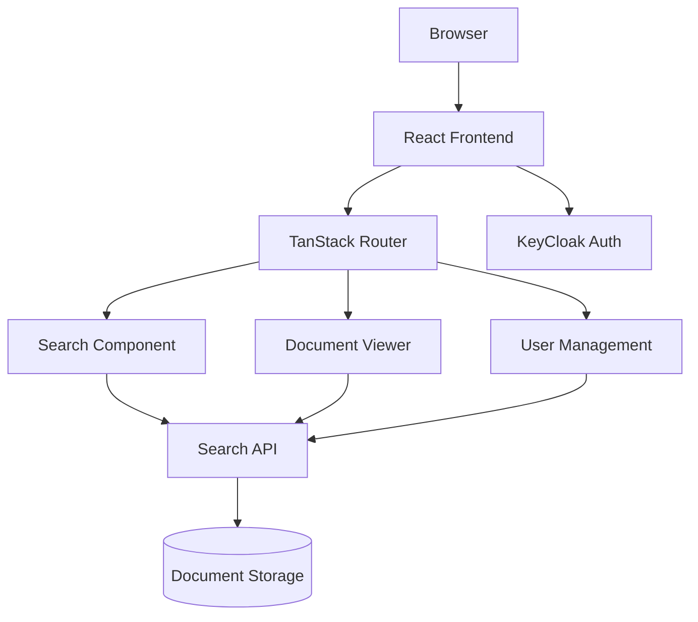
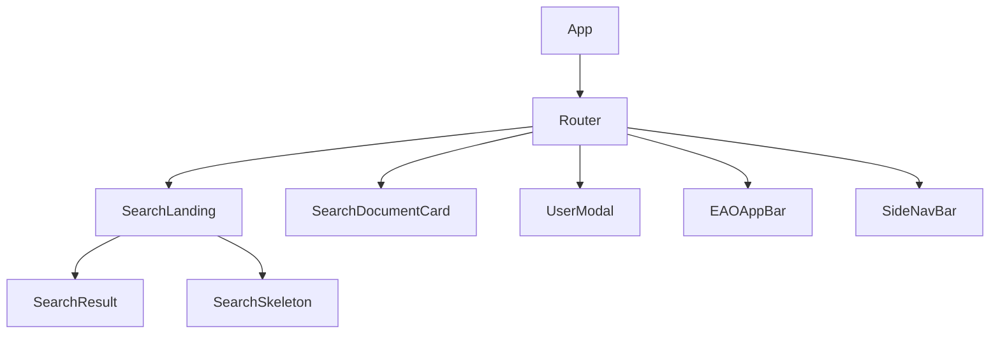
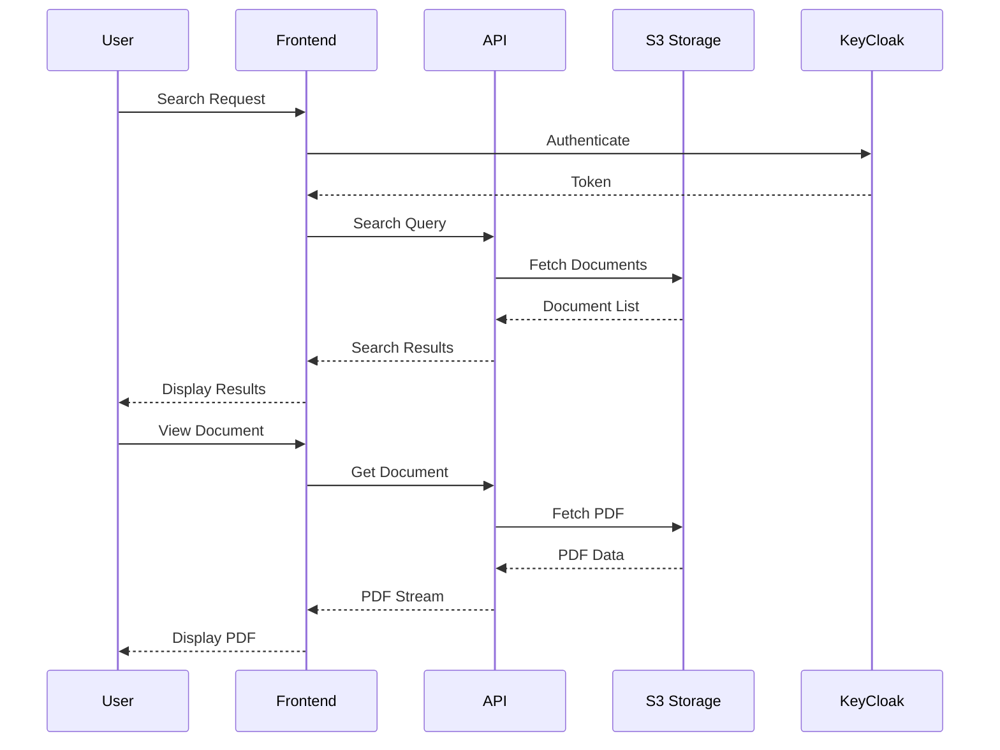
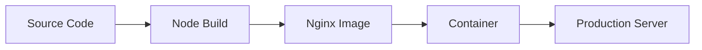

# EPIC.Search Technical Documentation

## Architecture Overview

This application is built using:

- React + TypeScript
- Vite as the build tool
- Material-UI for components
- TanStack Router for routing
- KeyCloak for authentication
- Axios for API communication

## Component Structure

## Data Flow

## Key Features

### Search Functionality
- Real-time search results
- Document preview cards
- Pagination support
- Filter capabilities

### Document Viewing
- In-browser PDF viewing
- Page navigation
- Direct page access
- Secure document access

### Authentication
- KeyCloak integration
- Role-based access control
- Session management

## API Integration

The application communicates with the backend API using Axios. Key endpoints:

- `/api/search` - Search documents
- `/api/document/view` - View document
- `/api/users` - User management

## State Management

The application uses React hooks for state management:
- `useSearch` - Manages search state and results
- `usePlans` - Handles environmental assessment plans
- `useUsers` - Manages user data and interactions

## Security

- Authentication via KeyCloak
- HTTPS enforced
- Secure document access
- Environment-based configuration

## Performance Considerations

- Lazy loading of routes
- PDF streaming
- Response caching
- Optimized search results

## Development Guidelines

### Code Structure

- Components in `src/components`
- Routes in `src/routes`
- Utilities in `src/utils`
- Models in `src/models`
- Styles in `src/styles`

### Best Practices

- TypeScript for type safety
- Component-based architecture
- Consistent error handling
- Environment-based configuration

### Testing

- Unit tests for components
- Integration tests for API calls
- End-to-end testing support

## Deployment

### Docker Deployment

The application includes a Dockerfile and nginx configuration for containerized deployment.

### Environment Configuration

- Development: `.env.development`
- Production: `.env.production`
- Runtime: Environment variables

## Troubleshooting

Common issues and solutions:

1. API Connection Issues
   - Check API URL configuration
   - Verify API is running
   - Check network connectivity

2. Authentication Issues
   - Verify KeyCloak configuration
   - Check token expiration
   - Validate user permissions

3. Document Viewing Issues
   - Verify S3 access
   - Check PDF viewer compatibility
   - Validate document permissions
