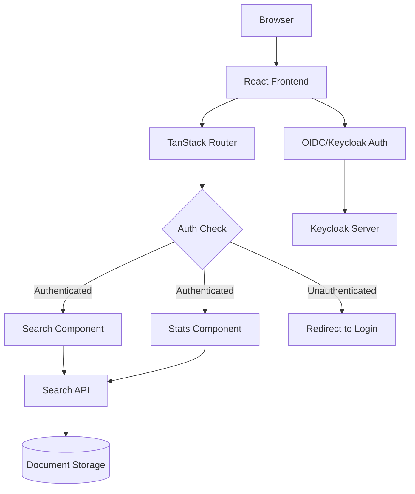
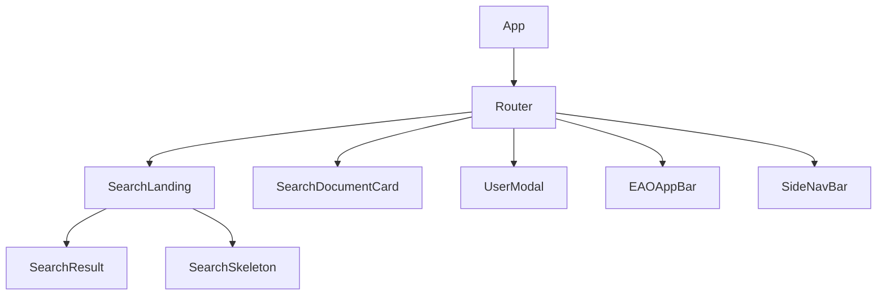
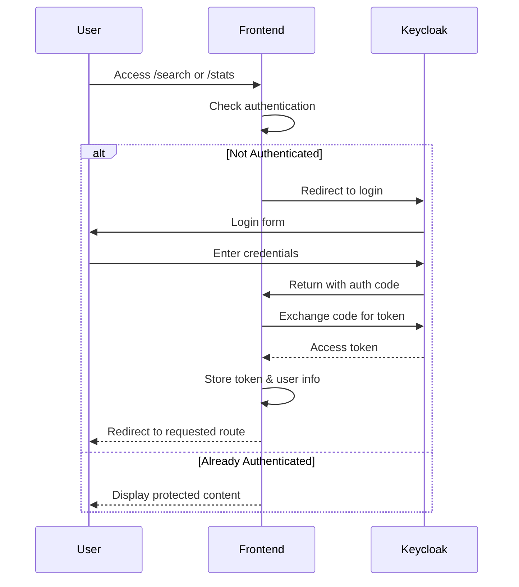
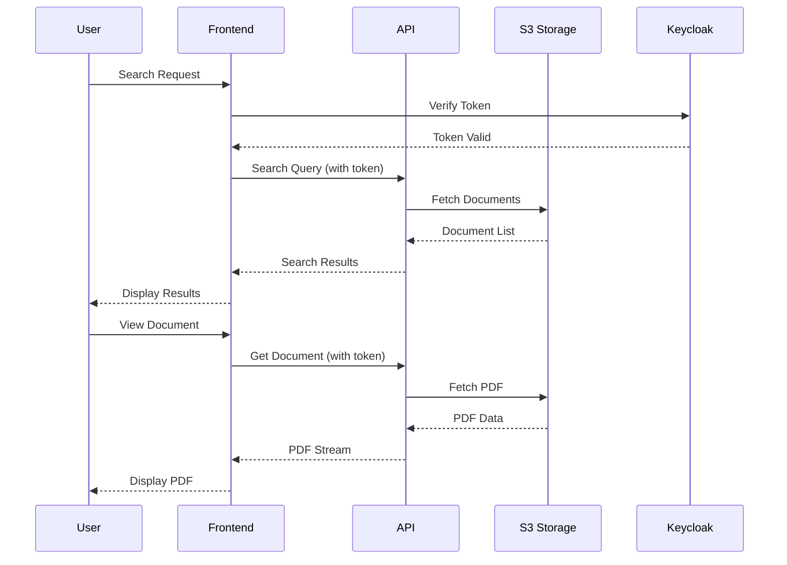
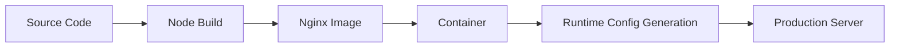

# EPIC.Search Technical Documentation

## Architecture Overview

This application is built using:

- React + TypeScript
- Vite as the build tool
- Material-UI for components
- TanStack Router for routing
- **OIDC/Keycloak for authentication** (required for search and stats)
- Axios for API communication

## Authentication Architecture

The application implements a **protected route pattern**:

- **Public Routes**: Home page (`/`) - accessible without authentication
- **Protected Routes**: Search (`/search`) and Statistics (`/stats`) - require authentication
- **Authentication Provider**: OIDC via Keycloak
- **Route Protection**: Automatic redirect to sign-in for unauthenticated users accessing protected routes



## Component Structure



## User Flow & Authentication

### Public Access
- **Home Page** (`/`): Accessible to all users
  - Displays information about environmental assessments
  - Shows "Sign In to Search" button for unauthenticated users
  - Shows "Search" button for authenticated users

### Protected Access (Authentication Required)
- **Search Functionality** (`/search`): Requires authentication
  - Advanced document search with AI strategies
  - Document filtering and results display
  - Automatic redirect to login if not authenticated

- **Statistics Dashboard** (`/stats`): Requires authentication  
  - Usage analytics and metrics
  - Search performance data
  - Automatic redirect to login if not authenticated

### Authentication Flow


## Data Flow



## Key Features

### Search Functionality

- Real-time search results
- Document preview cards
- Pagination support
- Filter capabilities

### Document Viewing

- In-browser PDF viewing
- Page navigation
- Direct page access
- Secure document access

### Authentication

- KeyCloak integration
- Role-based access control
- Session management

## API Integration

The application communicates with the backend API using Axios. Key endpoints:

- `/api/search` - Search documents
- `/api/document/view` - View document
- `/api/users` - User management

## State Management

The application uses React hooks for state management:

- `useSearch` - Manages search state and results
- `usePlans` - Handles environmental assessment plans
- `useUsers` - Manages user data and interactions

## Security

- Authentication via KeyCloak
- HTTPS enforced
- Secure document access
- Environment-based configuration

## Performance Considerations

- Lazy loading of routes
- PDF streaming
- Response caching
- Optimized search results

## Development Guidelines

### Code Structure

- Components in `src/components`
- Routes in `src/routes`
- Utilities in `src/utils`
- Models in `src/models`
- Styles in `src/styles`

### Best Practices

- TypeScript for type safety
- Component-based architecture
- Consistent error handling
- Environment-based configuration

### Testing

- Unit tests for components
- Integration tests for API calls
- End-to-end testing support

## Deployment

### Environment Configuration for Authentication

The application requires specific environment variables for authentication in different environments:

#### Local Development
```properties
VITE_API_URL=/api
VITE_APP_URL=http://localhost:3000
VITE_OIDC_AUTHORITY=https://dev.loginproxy.gov.bc.ca/auth/realms/eao-epic
VITE_CLIENT_ID=epic-search
PROXY_API_URL=http://127.0.0.1:8081
```

#### Test Environment (Azure App Service)
```properties
VITE_API_URL=/api
VITE_APP_URL=https://your-test-app.azurewebsites.net
VITE_OIDC_AUTHORITY=https://test.loginproxy.gov.bc.ca/auth/realms/eao-epic
VITE_CLIENT_ID=epic-search
PROXY_API_URL=https://your-backend-api-url
```

#### Production Environment (Azure App Service)
```properties
VITE_API_URL=/api
VITE_APP_URL=https://your-prod-app.com
VITE_OIDC_AUTHORITY=https://loginproxy.gov.bc.ca/auth/realms/eao-epic
VITE_CLIENT_ID=epic-search
PROXY_API_URL=https://your-prod-backend-api-url
```

### Keycloak Configuration Requirements

For each environment, the Keycloak client must be configured with:

**Valid Redirect URIs:**
- `{VITE_APP_URL}/oidc-callback`

**Web Origins:**
- `{VITE_APP_URL}`

**Valid Post Logout Redirect URIs:**
- `{VITE_APP_URL}/*`

### Docker Deployment

The application includes a Dockerfile and nginx configuration for containerized deployment with runtime environment variable injection.



### Environment Configuration

- **Development**: `.env` file with dev environment settings
- **Deployment**: Azure App Service environment variables
- **Runtime**: `env.sh` script generates `config.js` from environment variables

## Troubleshooting

Common issues and solutions:

### 1. API Connection Issues
- Check API URL configuration in environment variables
- Verify backend API is running and accessible
- Check network connectivity and firewall settings

### 2. Authentication Issues
- **CORS Errors**: Verify Keycloak client Web Origins configuration
- **Invalid Redirect URI**: Check Keycloak Valid Redirect URIs settings
- **Token Issues**: Verify OIDC Authority URL and Client ID
- **Sign-out Problems**: Check Valid Post Logout Redirect URIs in Keycloak
- **Environment Mismatch**: Ensure VITE_APP_URL matches your deployment URL

### 3. Route Protection Issues
- Verify authentication context is properly configured
- Check beforeLoad functions in protected routes
- Ensure useAuth hook is accessible in components

### 4. Document Viewing Issues
- Verify backend API access and authentication
- Check document permissions and access controls
- Validate PDF viewer compatibility

### 5. Deployment Issues
- **Config.js not generated**: Check environment variables in deployment platform
- **Authentication redirects to wrong URL**: Verify VITE_APP_URL in deployment
- **Mixed content errors**: Ensure all URLs use HTTPS in production
