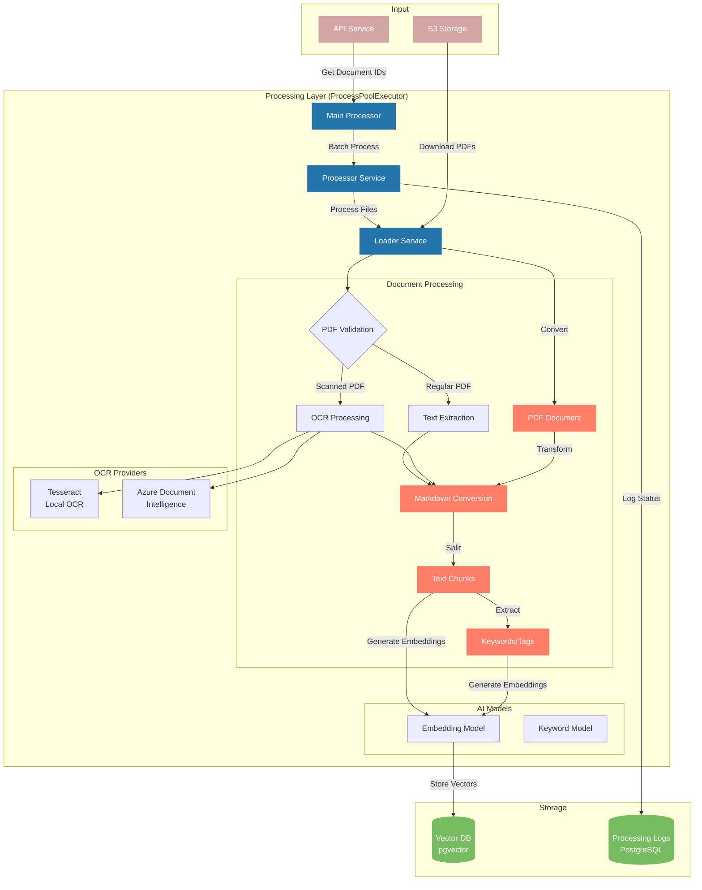
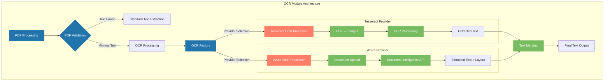

# EPIC.search Embedder - Technical Documentation

## System Architecture

The EPIC.search Embedder is a robust, production-grade document processing pipeline that converts PDF documents into vector embeddings for semantic search and analytics. The system is modular, scalable, and designed for extensibility and maintainability.

### Core Components

1. **Main Processor (`main.py`)** - Entry point for project and document processing workflow.
2. **Processor Service (`processor.py`)** - Manages batch processing of files with parallel execution.
3. **Loader Service (`loader.py`)** - Handles document loading, validation, text extraction, chunking, embedding, and tag extraction.
4. **Logger Service (`logger.py`)** - Tracks document processing status and metrics in the unified database.
5. **OCR Module (`src/services/ocr/`)** - Advanced OCR processing for scanned PDF documents with provider abstraction.

### 🆕 OCR Integration

The system now includes sophisticated OCR capabilities for processing scanned PDF documents:

- **Provider Abstraction**: Choose between Tesseract (local) and Azure Document Intelligence (cloud)
- **Automatic Detection**: Identifies scanned PDFs and routes them to OCR processing
- **Quality Processing**: High-DPI image conversion and advanced text extraction
- **Structured Output**: Maintains document metadata and page structure consistency

### System Flow Diagram



### Data Flow

1. Document IDs are fetched from the API for a specific project.
2. Document processing status is checked to avoid re-processing.
3. Documents are processed in batches using parallel execution.
4. Each document is:
   - Downloaded from S3
   - **Validated for text content** (routes scanned/image-based PDFs to OCR processing)
   - Processed via standard extraction or OCR (Tesseract/Azure Document Intelligence)
   - Converted from PDF to markdown
   - Chunked into smaller text segments
   - Embedded using a configurable vector model
   - Tagged/keyworded using parallelized KeyBERT extraction
   - Stored in a unified PostgreSQL+pgvector database
   - Metrics and logs are collected and stored as JSONB

## OCR Processing Architecture

The embedder includes a sophisticated OCR (Optical Character Recognition) system for processing scanned PDF documents that lack extractable text.

### Provider Architecture

The OCR system uses a factory pattern for provider abstraction:



### OCR Provider Interface

All OCR providers implement a common interface defined in `src/services/ocr/ocr_factory.py`:

```python
class OCRProcessor:
    def process_document(self, pdf_path: str) -> str:
        """Process a PDF document and return extracted text."""
        pass
```

### Provider Implementations

#### 1. Tesseract OCR Processor (`tesseract_ocr_processor.py`)

**Features:**

- Local processing with complete privacy
- Multi-language support (100+ languages)
- Configurable DPI and image preprocessing
- Page-by-page processing with progress tracking
- Automatic Tesseract installation detection

**Technical Details:**

- Converts PDF pages to high-DPI images using PyMuPDF
- Processes images with pytesseract for text extraction
- Supports custom Tesseract configurations via environment variables
- Handles large documents with memory-efficient page streaming

**Configuration:**

```env
TESSERACT_PATH=C:\Program Files\Tesseract-OCR\tesseract.exe  # Auto-detected if in PATH
OCR_DPI=300                    # Image quality (200-600 recommended)
OCR_LANGUAGE=eng               # Language code (eng, fra, deu, etc.)
```

#### 2. Azure Document Intelligence Processor (`azure_ocr_processor.py`)

**Features:**

- Cloud-based processing with superior accuracy
- Advanced layout understanding and structure preservation
- Confidence scores and metadata extraction
- Specialized for document processing (vs general OCR)
- Handles complex layouts, tables, and forms

**Technical Details:**

- Uses Azure Form Recognizer (Document Intelligence) API
- Uploads documents to Azure for processing
- Retrieves structured results with layout information
- Implements retry logic and error handling
- Supports various document formats beyond PDF

**Configuration:**

```env
AZURE_DOCUMENT_INTELLIGENCE_ENDPOINT=https://yourresource.cognitiveservices.azure.com/
AZURE_DOCUMENT_INTELLIGENCE_KEY=your_api_key_here
```

### OCR Factory and Provider Selection

The `OCRFactory` class manages provider instantiation and configuration:

```python
# Environment-based provider selection
OCR_PROVIDER=tesseract    # or 'azure'

# Factory creates appropriate provider
processor = OCRFactory.create_processor(provider_type)
```

### OCR Processing Flow

1. **Document Validation**: PDF is analyzed for extractable text content and device metadata
2. **Multi-Level Scanned Detection**:
   - **Primary**: Documents with no/minimal extractable text (< 1-50 chars)
   - **Secondary**: Scanning device metadata + minimal text (< 200 chars)
   - **Tertiary**: **All documents from known scanning devices** (for quality improvement)
3. **Provider Selection**: Factory creates the configured OCR provider (Tesseract/Azure)
4. **OCR Processing**:
   - **Tesseract**: PDF pages converted to high-quality images, then OCR processed
   - **Azure**: Document uploaded directly to Document Intelligence API
5. **Quality Assurance**: OCR results validated for meaningful text extraction
6. **Graceful Fallback**: If OCR fails on scanning device documents, falls back to standard extraction
7. **Result Integration**: OCR text integrated into standard processing pipeline with proper metadata tagging

### OCR Processing Behavior

#### **Automatic OCR Triggers**

The system automatically triggers OCR processing in these scenarios:

1. **📄 No Extractable Text**: PDF has no readable text content (classic scanned documents)
2. **🖨️ Scanning Device + Minimal Text**: Documents from devices like RICOH, HP scanners with < 200 characters
3. **🔧 Quality Enhancement**: **ALL** documents from known scanning devices get OCR for better text quality

#### **Status Outcomes**

- **✅ Success + OCR**: Document processed with OCR-extracted text, marked with `extraction_method: "ocr_tesseract"`
- **⚠️ Skipped**: Scanned documents when OCR is not available (status: `"skipped"`)
- **❌ Failed**: OCR was attempted but failed to extract meaningful text (status: `"failure"`)

#### **Known Scanning Device Detection**

Documents from these devices automatically trigger OCR processing:

- HP Digital Sending Device
- RICOH (IM series, etc.)
- Xerox devices
- Canon scanners
- Epson scanners
- Any device with "scanner" or "scan" in creator/producer metadata

### Performance Considerations

**Tesseract Optimization:**

- **DPI Settings**: Higher DPI (300-600) improves accuracy but increases processing time
- **Language Models**: Only load required language models to reduce memory usage
- **Image Preprocessing**: Automatic contrast and noise reduction improve results
- **Memory Management**: Page-by-page processing prevents memory exhaustion

**Azure Document Intelligence Optimization:**

- **Batch Processing**: Multiple documents can be processed concurrently
- **Regional Endpoints**: Use geographically close endpoints for better latency
- **Rate Limiting**: Built-in retry logic handles API rate limits
- **Cost Management**: Monitor API usage for cost optimization

### Error Handling and Fallbacks

**Tesseract Error Handling:**

- Graceful degradation when Tesseract is not installed
- Page-level error recovery (skip corrupted pages, continue processing)
- Language detection fallbacks
- Clear error messages for installation issues

**Azure Error Handling:**

- Network connectivity failure handling
- API authentication error recovery
- Service limit and quota management
- Automatic retry with exponential backoff

**Provider Fallback:**

- No automatic fallback between providers (explicit configuration required)
- Clear error messages guide users to alternative providers
- Validation ensures provider dependencies are available

## NLP Model Architecture

The system uses two distinct models for different NLP tasks, both configurable and independently scalable:

### 1. Document Embedding Model

- Configured via `EMBEDDING_MODEL_NAME` and `EMBEDDING_DIMENSIONS` in settings.
- Used to generate vector embeddings for document chunks.
- Embedding dimensions are fully configurable (default: 768).
- Embeddings are stored in the vector database for semantic search.

### 2. Keyword/Tag Extraction Model

- Configured via `KEYWORD_MODEL_NAME` in settings.
- Uses KeyBERT with a transformer backend for robust keyword extraction.
- Extraction is parallelized per chunk for speed and reliability.
- Extracted tags/keywords are stored and indexed for search and analytics.

### Model Independence & Lazy Loading

- Both models are loaded only when first used (lazy loading), improving startup time and resource usage.
- Models can be configured independently for task-specific optimization and future extensibility.

## Unified Database Structure

All vector data (chunks, documents, projects, logs, metrics) are stored in a single PostgreSQL database with the pgvector extension. No legacy table name configs or separate logs DB are used.

- **Tables:**
  - `document_chunks` (vector embeddings, chunk content, metadata)
  - `document_tags` (tag/keyword embeddings, metadata)
  - `projects` (project metadata)
  - `documents` (document metadata)
  - `processing_logs` (status, metrics, JSONB)
    - **Status values**: `"success"`, `"failure"`, `"skipped"`
    - **Metrics**: Complete processing details, timings, document info, and validation reasons

- **Embedding Dimensions:**
  - Set via `EMBEDDING_DIMENSIONS` in `settings.py` (default: 768)
  - All vector columns use this dimension

- **Indexing:**
  - HNSW vector indexes are created via raw SQL after table creation for fast semantic search

- **Metrics:**
  - Structured metrics (timings, counts, errors, etc.) are collected and stored as JSONB in the logs table

- **pgvector Extension:**
  - The system can auto-create the pgvector extension if needed (configurable)

## Configuration

All configuration is managed via environment variables and loaded by `get_settings()` in `src/config/settings.py`.

- **Key settings:**
  - API, S3, and database connection details
  - Embedding and keyword model names
  - Embedding dimensions
  - Processing concurrency
  - `reset_db` flag for safe table (re)creation

- **Example environment variables:**

  | Variable Name         | Purpose                                 | Default/Auto Value           |
  |----------------------|-----------------------------------------|------------------------------|
  | EMBEDDING_MODEL_NAME | Model for document embeddings            | "all-mpnet-base-v2"          |
  | KEYWORD_MODEL_NAME   | Model for keyword extraction             | "all-mpnet-base-v2"          |
  | EMBEDDING_DIMENSIONS | Embedding vector size                    | 768                          |
  | FILES_CONCURRENCY_SIZE | Number of files to process in parallel | auto (intelligent CPU-based) |
  | KEYWORD_EXTRACTION_WORKERS | Threads per document for keywords | auto (optimized for KeyBERT) |
  | GET_PROJECT_PAGE     | Number of projects to fetch per API call | 1                           |
  | GET_DOCS_PAGE        | Number of documents to fetch per API call | 1000                        |
  | CHUNK_SIZE           | Size of text chunks in characters        | 1000                        |
  | CHUNK_OVERLAP        | Number of characters to overlap between chunks | 200                     |
  | CHUNK_INSERT_BATCH_SIZE | Number of chunks per database batch   | 25 (50 for high-RAM systems) |
  | AUTO_CREATE_PGVECTOR_EXTENSION | Auto-create pgvector extension   | True                        |

### Intelligent Auto-Configuration

The embedder supports intelligent auto-configuration for optimal performance across different hardware:

**FILES_CONCURRENCY_SIZE Options:**

- `auto` - Half CPU cores for 16+ core systems (prevents over-parallelization)
- `auto-full` - All CPU cores (maximum parallelism)
- `auto-conservative` - Quarter CPU cores (resource-constrained environments)
- Integer value - Manual override

**KEYWORD_EXTRACTION_WORKERS Options:**

- `auto` - Optimized for KeyBERT bottleneck (2 threads for 16+ cores, 3 for 8-15 cores, 4 for <8 cores)
- `auto-aggressive` - 4 threads per process (maximum keyword parallelism)
- `auto-conservative` - 1 thread per process (minimal thread contention)
- Integer value - Manual override

**Example configurations:**

```bash
# High-performance server (32+ cores)
FILES_CONCURRENCY_SIZE=auto          # Uses 16 processes
KEYWORD_EXTRACTION_WORKERS=auto      # Uses 2 threads per process = 32 total threads

# Development machine (4-8 cores)
FILES_CONCURRENCY_SIZE=auto          # Uses all 4-8 cores
KEYWORD_EXTRACTION_WORKERS=auto      # Uses 3-4 threads per process

# Resource-constrained environment
FILES_CONCURRENCY_SIZE=auto-conservative  # Uses quarter of cores
KEYWORD_EXTRACTION_WORKERS=auto-conservative  # Uses 1 thread per process
```

## Tag/Keyword Extraction

- Tag extraction is performed per chunk using KeyBERT, parallelized with ThreadPoolExecutor.
- Robust error handling ensures extraction failures do not halt processing.
- No batch embedding is used for KeyBERT due to model limitations.
- Extracted tags are aggregated and stored for each document.

## Metrics & Logging

The system collects comprehensive metrics and document metadata for all processing attempts, whether successful, failed, or skipped.

### Processing Status Classification

The system intelligently classifies processing outcomes into three categories:

- **🟢 Success**: Document was successfully processed, chunked, and embedded
- **🟡 Skipped**: Document was intentionally not processed (non-PDF files, scanned PDFs without OCR)
- **🔴 Failure**: Document processing attempted but failed due to errors

#### Status Classification Logic

| **File Type/Issue** | **Validation Reason** | **Status** | **Description** |
|-------------------|-------------------|----------|-------------|
| **XLS, JPG, TXT files** | `precheck_failed` | **🟡 skipped** | Not a PDF file - can't be processed by PDF embedder |
| **Scanned PDF (no OCR)** | `scanned_or_image_pdf` | **🟡 skipped** | Scanned PDF but OCR not available/enabled |
| **OCR Processing Failed** | `ocr_failed` | **🔴 failure** | OCR was attempted but failed to extract text |
| **Exception/Error** | Various errors | **🔴 failure** | Actual processing failures, exceptions, or validation errors |

### Processing Metrics Collection

- **All processing steps** collect structured metrics (timings, counts, errors, etc.)
- **Metrics are stored as JSONB** in the `processing_logs` table for analytics and monitoring
- **Document metadata is always captured**, including:
  - Document name and S3 key
  - File size in bytes
  - Complete PDF metadata (title, author, creator, creation date, etc.)
  - Page count
  - Validation status and processing reason

### Enhanced Analysis Queries

The system provides detailed insights by capturing document metadata for all processing outcomes:

```sql
-- Processing status overview
SELECT status, COUNT(*) as count
FROM processing_logs 
GROUP BY status;

-- Find all failed PDFs with their metadata
SELECT document_id, status, 
       metrics->'document_info'->>'metadata' as pdf_metadata,
       metrics->'document_info'->>'page_count' as page_count,
       metrics->'document_info'->>'file_size_bytes' as file_size,
       metrics->'document_info'->>'validation_reason' as processing_reason
FROM processing_logs 
WHERE status = 'failure';

-- Find skipped files by type
SELECT document_id, 
       metrics->'document_info'->>'document_name' as doc_name,
       metrics->'document_info'->>'validation_reason' as skip_reason
FROM processing_logs 
WHERE status = 'skipped';

-- Find documents by PDF creator or title
SELECT document_id, 
       metrics->'document_info'->>'document_name' as doc_name,
       metrics->'document_info'->'metadata'->>'title' as pdf_title,
       metrics->'document_info'->'metadata'->>'creator' as pdf_creator
FROM processing_logs 
WHERE metrics->'document_info'->'metadata'->>'creator' IS NOT NULL;

-- Find scanned PDFs processed with OCR
SELECT document_id, 
       metrics->'document_info'->>'document_name' as doc_name,
       metrics->>'extraction_method' as extraction_method,
       metrics->'document_info'->'metadata' as pdf_metadata
FROM processing_logs 
WHERE status = 'success' 
AND metrics->>'extraction_method' = 'ocr_tesseract';
```

### Metrics Structure

**Success cases** include:

- Complete document metadata
- Processing timing metrics for each step
- Chunk and embedding statistics
- Extraction method (standard_pdf or ocr_tesseract)

**Skipped cases** include:

- Basic document information (name, size, type)
- Validation reason explaining why processing was skipped
- File format details for non-PDF files

**Failure cases** include:

- Complete PDF metadata (title, author, creator, creation date, format info, etc.)
- Validation failure reasons
- Exception details and full traceback (for runtime errors)
- Processing metrics up to the point of failure

The `reset_db` flag allows safe table (re)creation for development or migration.

## Docker Deployment

- Supports both runtime and preloaded model builds for fast startup in production.
- See README.md for up-to-date deployment instructions and environment variable usage.

## Extensibility & Best Practices

- Modular design allows for easy extension (new document types, models, chunking strategies, etc.).
- All code is documented with clear docstrings and error handling.
- See README.md for usage, configuration, and deployment details.

## PDF Validation & Scanned Document Processing

The system includes intelligent PDF validation and automatic OCR processing for scanned/image-based documents.

### Enhanced Validation & Processing Logic

The validation process uses a two-tier approach with OCR fallback:

1. **Primary Check - Content Analysis**:
   - Extracts text from the first page
   - If no extractable text or minimal content patterns detected (e.g., "-----")
   - **NEW**: Automatically attempts OCR processing if Tesseract is available

2. **Secondary Check - Producer/Creator Analysis**:
   - Identifies common scanning device signatures in PDF metadata
   - Supported indicators: HP Digital Sending Device, Scanner, Xerox, Canon, Epson, Ricoh, etc.
   - If scanning device detected AND minimal text content (< 200 characters)
   - **NEW**: Automatically attempts OCR processing if available

3. **Tertiary Check - Known Scanning Devices (Enhanced)**:
   - **All documents from known scanning devices** are now processed with OCR for better quality
   - Even if standard PDF text extraction succeeds, OCR may provide superior results
   - Graceful fallback: If OCR fails, uses standard text extraction instead of failing
   - This ensures maximum text quality from scanned/printed documents

### OCR Processing Features

The embedder now includes advanced **Optical Character Recognition (OCR)** capabilities with a clean provider abstraction:

#### 🏗️ **OCR Architecture**

**Modular Design:**

```files
src/services/ocr/
├── __init__.py              # Public API exports
├── ocr_factory.py          # Provider abstraction and factory
├── tesseract_ocr_processor.py  # Local Tesseract implementation
└── azure_ocr_processor.py     # Azure Document Intelligence implementation
```

**Factory Pattern:**

- **Provider Selection**: Environment variable `OCR_PROVIDER` controls which implementation to use
- **Unified Interface**: Same function calls work with any provider
- **Dynamic Loading**: Providers are loaded on-demand based on configuration
- **Extensible**: Easy to add new OCR providers (Google Cloud Vision, AWS Textract, etc.)

#### 🎯 **Provider Comparison**

| Feature | Tesseract (Local) | Azure Document Intelligence |
|---------|-------------------|----------------------------|
| **Accuracy** | Good for most documents | Excellent for complex documents |
| **Cost** | Free | Pay-per-use API calls |
| **Privacy** | Complete privacy (local) | Data sent to Azure cloud |
| **Speed** | Moderate | Fast (cloud processing) |
| **Setup** | Install software | Azure account + API key |
| **Internet** | Not required | Required |
| **Languages** | 100+ languages | 73 languages |
| **Layout** | Basic text extraction | Advanced layout understanding |
| **Dependencies** | pytesseract, Pillow | azure-ai-formrecognizer |

#### 🔧 **Technical Implementation**

**Tesseract Provider:**

- Uses **PyMuPDF** to convert PDF pages to high-DPI images
- **pytesseract** processes images with configurable OCR settings
- **Page Segmentation Mode 1**: Automatic page segmentation with OSD (Orientation and Script Detection)
- **OCR Engine Mode 3**: Default OCR engine for best compatibility
- **Error Handling**: Graceful per-page failure handling with detailed logging

**Azure Document Intelligence Provider:**

- Uses **Azure Form Recognizer Layout API** for superior document understanding
- **Batch Processing**: Submits entire PDF files for more efficient processing
- **Advanced Features**: Layout analysis, confidence scores, table detection
- **Rate Limiting**: Built-in delays and retry logic for API compliance
- **Structured Output**: Preserves document structure and formatting

#### 🛠️ **Configuration Options**

**Core Settings:**

```env
OCR_ENABLED=true              # Enable/disable OCR processing
OCR_PROVIDER=tesseract        # Provider: 'tesseract' or 'azure'
OCR_DPI=300                   # Image quality for OCR
OCR_LANGUAGE=eng              # Language code (eng, fra, deu, etc.)
```

**Tesseract Settings:**

```env
# TESSERACT_PATH=C:\Program Files\Tesseract-OCR\tesseract.exe  # Optional
```

**Azure Document Intelligence Settings:**

```env
# AZURE_DOCUMENT_INTELLIGENCE_ENDPOINT=https://yourresource.cognitiveservices.azure.com/
# AZURE_DOCUMENT_INTELLIGENCE_KEY=your_api_key_here
```

#### 📊 **Processing Workflow**

1. **Document Validation**: PDF validation identifies scanned documents
2. **Provider Selection**: Factory determines active OCR provider from configuration
3. **OCR Processing**: Selected provider extracts text using appropriate API/engine
4. **Metadata Integration**: OCR results integrated with standard document processing pipeline
5. **Quality Metrics**: Confidence scores and extraction statistics logged

#### 🎯 **Benefits**

- **Comprehensive Coverage**: Processes both standard and scanned PDFs automatically
- **No Manual Intervention**: Automatic detection and routing to OCR
- **Provider Flexibility**: Choose optimal provider based on accuracy, cost, and privacy needs
- **Production Ready**: Robust error handling, logging, and progress tracking
- **Future-Proof**: Extensible architecture for additional OCR providers
- **Consistent Interface**: Same API regardless of underlying OCR technology

### Benefits

- **Comprehensive Processing**: Now processes both standard and scanned PDFs automatically
- **No Manual Intervention**: Automatic detection and processing of scanned documents
- **Resource Optimization**: Efficient OCR processing with configurable quality settings
- **Fallback Capability**: Gracefully skips documents if OCR is unavailable
- **Detailed Metrics**: Complete processing statistics including OCR success rates

### OCR Configuration

OCR functionality can be configured via environment variables:

- `OCR_ENABLED=true` - Enable/disable OCR processing
- `TESSERACT_PATH` - Path to Tesseract executable (auto-detected if not set)
- `OCR_DPI=300` - Image resolution for OCR (higher = better quality)
- `OCR_LANGUAGE=eng` - Language code for OCR processing

Documents are now automatically processed regardless of whether they're standard PDFs or scanned images, providing comprehensive text extraction coverage.

---

For full usage, configuration, and deployment instructions, see the updated `README.md`.
