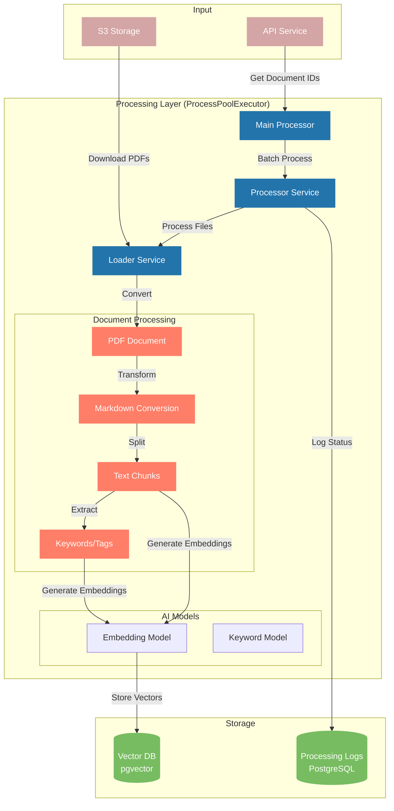

# EPIC.search Embedder - Technical Documentation

## System Architecture

The EPIC.search Embedder is a robust, production-grade document processing pipeline that converts PDF documents into vector embeddings for semantic search and analytics. The system is modular, scalable, and designed for extensibility and maintainability.

### Core Components

1. **Main Processor (`main.py`)** - Entry point for project and document processing workflow.
2. **Processor Service (`processor.py`)** - Manages batch processing of files with parallel execution.
3. **Loader Service (`loader.py`)** - Handles document loading, validation, text extraction, chunking, embedding, and tag extraction.
4. **Logger Service (`logger.py`)** - Tracks document processing status and metrics in the unified database.

### System Flow Diagram



### Data Flow

1. Document IDs are fetched from the API for a specific project.
2. Document processing status is checked to avoid re-processing.
3. Documents are processed in batches using parallel execution.
4. Each document is:
   - Downloaded from S3
   - **Validated for text content** (skips scanned/image-based PDFs that would require OCR)
   - Converted from PDF to markdown
   - Chunked into smaller text segments
   - Embedded using a configurable vector model
   - Tagged/keyworded using parallelized KeyBERT extraction
   - Stored in a unified PostgreSQL+pgvector database
   - Metrics and logs are collected and stored as JSONB

## NLP Model Architecture

The system uses two distinct models for different NLP tasks, both configurable and independently scalable:

### 1. Document Embedding Model

- Configured via `EMBEDDING_MODEL_NAME` and `EMBEDDING_DIMENSIONS` in settings.
- Used to generate vector embeddings for document chunks.
- Embedding dimensions are fully configurable (default: 768).
- Embeddings are stored in the vector database for semantic search.

### 2. Keyword/Tag Extraction Model

- Configured via `KEYWORD_MODEL_NAME` in settings.
- Uses KeyBERT with a transformer backend for robust keyword extraction.
- Extraction is parallelized per chunk for speed and reliability.
- Extracted tags/keywords are stored and indexed for search and analytics.

### Model Independence & Lazy Loading

- Both models are loaded only when first used (lazy loading), improving startup time and resource usage.
- Models can be configured independently for task-specific optimization and future extensibility.

## Unified Database Structure

All vector data (chunks, documents, projects, logs, metrics) are stored in a single PostgreSQL database with the pgvector extension. No legacy table name configs or separate logs DB are used.

- **Tables:**
  - `document_chunks` (vector embeddings, chunk content, metadata)
  - `document_tags` (tag/keyword embeddings, metadata)
  - `projects` (project metadata)
  - `documents` (document metadata)
  - `processing_logs` (status, metrics, JSONB)

- **Embedding Dimensions:**
  - Set via `EMBEDDING_DIMENSIONS` in `settings.py` (default: 768)
  - All vector columns use this dimension

- **Indexing:**
  - HNSW vector indexes are created via raw SQL after table creation for fast semantic search

- **Metrics:**
  - Structured metrics (timings, counts, errors, etc.) are collected and stored as JSONB in the logs table

- **pgvector Extension:**
  - The system can auto-create the pgvector extension if needed (configurable)

## Configuration

All configuration is managed via environment variables and loaded by `get_settings()` in `src/config/settings.py`.

- **Key settings:**
  - API, S3, and database connection details
  - Embedding and keyword model names
  - Embedding dimensions
  - Processing concurrency
  - `reset_db` flag for safe table (re)creation

- **Example environment variables:**

  | Variable Name         | Purpose                                 | Default/Auto Value           |
  |----------------------|-----------------------------------------|------------------------------|
  | EMBEDDING_MODEL_NAME | Model for document embeddings            | "all-mpnet-base-v2"          |
  | KEYWORD_MODEL_NAME   | Model for keyword extraction             | "all-mpnet-base-v2"          |
  | EMBEDDING_DIMENSIONS | Embedding vector size                    | 768                          |
  | FILES_CONCURRENCY_SIZE | Number of files to process in parallel | auto (intelligent CPU-based) |
  | KEYWORD_EXTRACTION_WORKERS | Threads per document for keywords | auto (optimized for KeyBERT) |
  | GET_PROJECT_PAGE     | Number of projects to fetch per API call | 1                           |
  | GET_DOCS_PAGE        | Number of documents to fetch per API call | 1000                        |
  | CHUNK_SIZE           | Size of text chunks in characters        | 1000                        |
  | CHUNK_OVERLAP        | Number of characters to overlap between chunks | 200                     |
  | CHUNK_INSERT_BATCH_SIZE | Number of chunks per database batch   | 25 (50 for high-RAM systems) |
  | AUTO_CREATE_PGVECTOR_EXTENSION | Auto-create pgvector extension   | True                        |

### Intelligent Auto-Configuration

The embedder supports intelligent auto-configuration for optimal performance across different hardware:

**FILES_CONCURRENCY_SIZE Options:**
- `auto` - Half CPU cores for 16+ core systems (prevents over-parallelization)
- `auto-full` - All CPU cores (maximum parallelism)
- `auto-conservative` - Quarter CPU cores (resource-constrained environments)
- Integer value - Manual override

**KEYWORD_EXTRACTION_WORKERS Options:**
- `auto` - Optimized for KeyBERT bottleneck (2 threads for 16+ cores, 3 for 8-15 cores, 4 for <8 cores)
- `auto-aggressive` - 4 threads per process (maximum keyword parallelism)
- `auto-conservative` - 1 thread per process (minimal thread contention)
- Integer value - Manual override

**Example configurations:**
```bash
# High-performance server (32+ cores)
FILES_CONCURRENCY_SIZE=auto          # Uses 16 processes
KEYWORD_EXTRACTION_WORKERS=auto      # Uses 2 threads per process = 32 total threads

# Development machine (4-8 cores)
FILES_CONCURRENCY_SIZE=auto          # Uses all 4-8 cores
KEYWORD_EXTRACTION_WORKERS=auto      # Uses 3-4 threads per process

# Resource-constrained environment
FILES_CONCURRENCY_SIZE=auto-conservative  # Uses quarter of cores
KEYWORD_EXTRACTION_WORKERS=auto-conservative  # Uses 1 thread per process
```

## Tag/Keyword Extraction

- Tag extraction is performed per chunk using KeyBERT, parallelized with ThreadPoolExecutor.
- Robust error handling ensures extraction failures do not halt processing.
- No batch embedding is used for KeyBERT due to model limitations.
- Extracted tags are aggregated and stored for each document.

## Metrics & Logging

The system collects comprehensive metrics and document metadata for all processing attempts, whether successful or failed.

### Processing Metrics Collection

- **All processing steps** collect structured metrics (timings, counts, errors, etc.)
- **Metrics are stored as JSONB** in the `processing_logs` table for analytics and monitoring
- **Document metadata is always captured**, including:
  - Document name and S3 key
  - File size in bytes
  - Complete PDF metadata (title, author, creator, creation date, etc.)
  - Page count
  - Validation status and failure reasons

### Enhanced Failure Analysis

The system provides detailed failure insights by capturing document metadata even when processing fails:

```sql
-- Find all failed PDFs with their metadata
SELECT document_id, status, 
       metrics->'document_info'->>'metadata' as pdf_metadata,
       metrics->'document_info'->>'page_count' as page_count,
       metrics->'document_info'->>'file_size_bytes' as file_size,
       metrics->'document_info'->>'validation_reason' as failure_reason
FROM processing_logs 
WHERE status = 'failure';

-- Find documents by PDF creator or title
SELECT document_id, 
       metrics->'document_info'->>'document_name' as doc_name,
       metrics->'document_info'->'metadata'->>'title' as pdf_title,
       metrics->'document_info'->'metadata'->>'creator' as pdf_creator
FROM processing_logs 
WHERE metrics->'document_info'->'metadata'->>'creator' IS NOT NULL;

-- Find scanned/image PDFs specifically
SELECT document_id, 
       metrics->'document_info'->>'document_name' as doc_name,
       metrics->'document_info'->'metadata' as pdf_metadata
FROM processing_logs 
WHERE status = 'failure' 
AND metrics->'document_info'->>'validation_reason' LIKE '%scanned%';
```

### Metrics Structure

**Success cases** include:

- Complete document metadata
- Processing timing metrics for each step
- Chunk and embedding statistics

**Failure cases** include:

- Complete PDF metadata (title, author, creator, creation date, format info, etc.)
- Validation failure reasons
- Exception details and full traceback (for runtime errors)
- Processing metrics up to the point of failure

The `reset_db` flag allows safe table (re)creation for development or migration.

## Docker Deployment

- Supports both runtime and preloaded model builds for fast startup in production.
- See README.md for up-to-date deployment instructions and environment variable usage.

## Extensibility & Best Practices

- Modular design allows for easy extension (new document types, models, chunking strategies, etc.).
- All code is documented with clear docstrings and error handling.
- See README.md for usage, configuration, and deployment details.

## PDF Validation & Scanned Document Detection

The system includes intelligent PDF validation to identify and skip scanned/image-based documents that would require OCR processing.

### Validation Logic

The validation process uses a two-tier approach:

1. **Primary Check - Content Analysis**:
   - Extracts text from the first page
   - Rejects documents with no extractable text or minimal content patterns (e.g., "-----")
   - Version-agnostic approach works regardless of PDF format version

2. **Secondary Check - Producer/Creator Analysis**:
   - Identifies common scanning device signatures in PDF metadata
   - Supported indicators: HP Digital Sending Device, Scanner, Xerox, Canon, Epson, Ricoh, etc.
   - If scanning device detected AND minimal text content (< 50 characters), document is rejected

### Benefits

- **Efficient processing**: Avoids attempting to process image-heavy documents
- **Resource optimization**: Prevents time/compute waste on documents requiring OCR
- **Comprehensive detection**: Catches scanned PDFs regardless of version (1.4, 1.7, 2.0+)
- **Future-proof**: Content-based validation adapts to new scanning technologies

Documents identified as scanned are logged with detailed metadata for potential future OCR processing.

---

For full usage, configuration, and deployment instructions, see the updated `README.md`.
